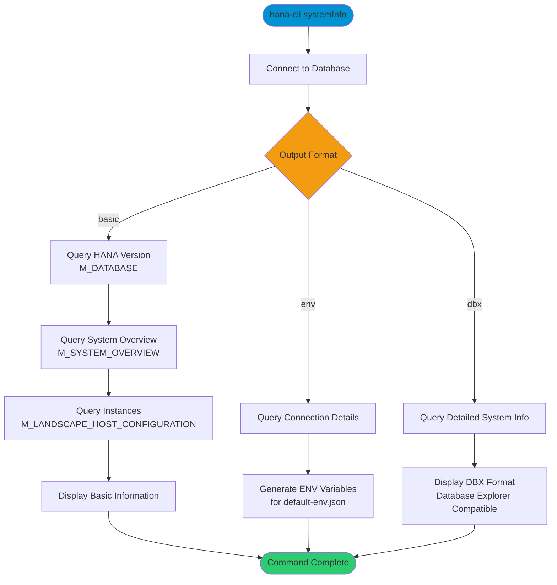

# systemInfo

> Command: `systemInfo`  
> Category: **System Admin**  
> Status: Production Ready

## Description

Display comprehensive SAP HANA system information including database version, system overview, instance details, and configuration. This command provides three output formats: basic (version and overview), env (environment variables for connection setup), and dbx (detailed database explorer format).

## Syntax

```bash
hana-cli systemInfo [options]
```

## Aliases

- `sys`
- `sysinfo`
- `sysInfo`
- `systeminfo`
- `system-information`
- `dbInfo`
- `dbinfo`

## Command Diagram



## Parameters

### Options

| Option     | Alias        | Type   | Default | Description                                                                 |
|------------|--------------|--------|---------|-----------------------------------------------------------------------------|
| `--output` | `-o`, `--Output` | string | `basic` | Output format. Choices: `basic`, `env`, `dbx`                           |

### Connection Parameters

| Option    | Alias | Type    | Default | Description                                          |
|-----------|-------|---------|---------|------------------------------------------------------|
| `--admin` | `-a`  | boolean | `false` | Connect via admin (default-env-admin.json)           |
| `--conn`  | -     | string  | -       | Connection filename to override default-env.json     |

### Troubleshooting

| Option              | Alias     | Type    | Default | Description                                                                                              |
|---------------------|-----------|---------|---------|----------------------------------------------------------------------------------------------------------|
| `--disableVerbose`  | `--quiet` | boolean | `false` | Disable verbose output - removes all extra output that is only helpful to human readable interface       |
| `--debug`           | `-d`      | boolean | `false` | Debug hana-cli itself by adding output of LOTS of intermediate details                                   |

## Examples

### Basic System Information

```bash
hana-cli systemInfo
```

Display basic system information including HANA version and system overview.

### Detailed Output

```bash
hana-cli systemInfo --output basic
```

Display comprehensive system details with instance topology.

### Environment Variables Format

```bash
hana-cli systemInfo --output env
```

Generate environment variables suitable for default-env.json configuration.

### Database Explorer Format

```bash
hana-cli systemInfo --output dbx
```

Display system information in Database Explorer compatible format.

---

## systemInfoUI (UI Variant)

> Command: `systemInfoUI`  
> Status: Production Ready

**Description:** General System Details in Browser Based UI

**Syntax:**

```bash
hana-cli systemInfoUI [options]
```

**Aliases:**

- `sysUI`
- `sysinfoui`
- `sysInfoUI`
- `systeminfoui`

**Parameters:**

For a complete list of parameters and options, use:

```bash
hana-cli systemInfoUI --help
```

**Example Usage:**

```bash
hana-cli systemInfoUI
```

Execute the command

## Related Commands

See the [Commands Reference](../all-commands.md) for other commands in this category.

## See Also

- [Category: System Tools](..)
- [All Commands A-Z](../all-commands.md)
