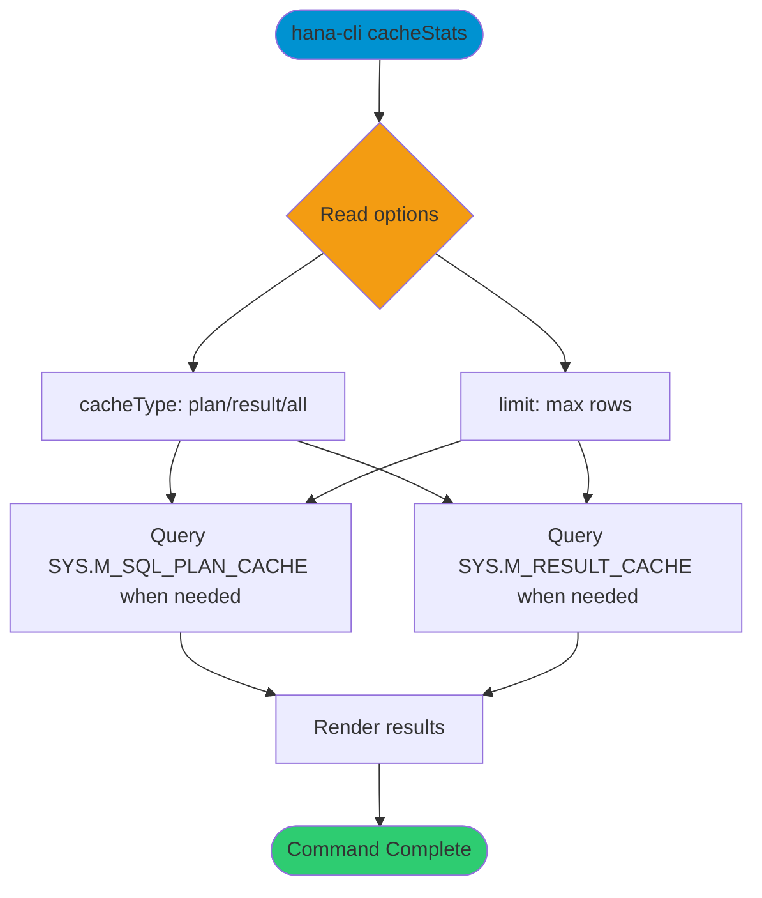

# cacheStats

> Command: `cacheStats`  
> Category: **System Tools**  
> Status: Production Ready

## Description

This page exists for the `/cache-contents` route. Use `cacheStats` to view SQL plan cache and result cache statistics.

## Syntax

```bash
hana-cli cacheStats [options]
```

## Command Diagram



## Aliases

- No aliases

## Parameters

### Options

| Option | Alias | Type | Default | Description |
|--------|-------|------|---------|-------------|
| `--cacheType` | `-t` | string | `all` | Cache type to query. Choices: `plan`, `result`, `all` |
| `--limit` | `-l` | number | `50` | Maximum rows returned per cache query |

For complete option output, use:

```bash
hana-cli cacheStats --help
```

## Examples

### Basic Usage

```bash
hana-cli cacheStats --cacheType all
```

View SQL plan cache and result cache statistics

## Related Commands

See the [Commands Reference](../all-commands.md) for other commands in this category.

## See Also

- [Cache Statistics](../performance-monitoring/cache-stats.md)
- [All Commands A-Z](../all-commands.md)
