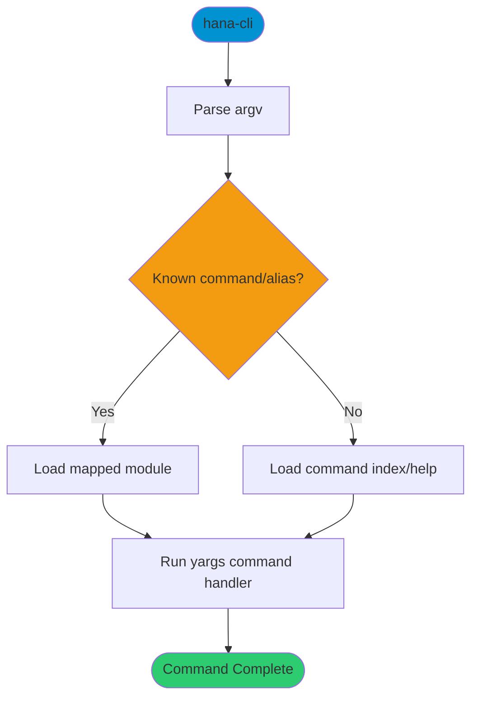

# cli

> Command: `hana-cli`  
> Category: **System Tools**  
> Status: Production Ready

## Description

Launcher entrypoint for the hana-cli runtime.

## ⚠️ Redirect Notice

This page documents the CLI launcher behavior. It is not a standalone subcommand entry like `connect` or `tables`.

## Syntax

```bash
hana-cli <command> [options]
```

## Command Diagram



## Aliases

- No aliases

## Parameters

### Positional Arguments

| Parameter | Type | Description |
|-----------|------|-------------|
| `command` | string | Command name or alias to execute |

### Options

| Option | Alias | Type | Default | Description |
|--------|-------|------|---------|-------------|
| `--help` | `-h` | boolean | `false` | Show CLI help |
| `--version` | `-V` | boolean | `false` | Show version information (mapped to `version` command) |

For complete global help, use:

```bash
hana-cli --help
```

## Examples

### Basic Usage

```bash
hana-cli --help
```

Show available commands and global options.

## Related Commands

See the [Commands Reference](../all-commands.md) for other commands in this category.

## See Also

- [Category: System Tools](..)
- [All Commands A-Z](../all-commands.md)
