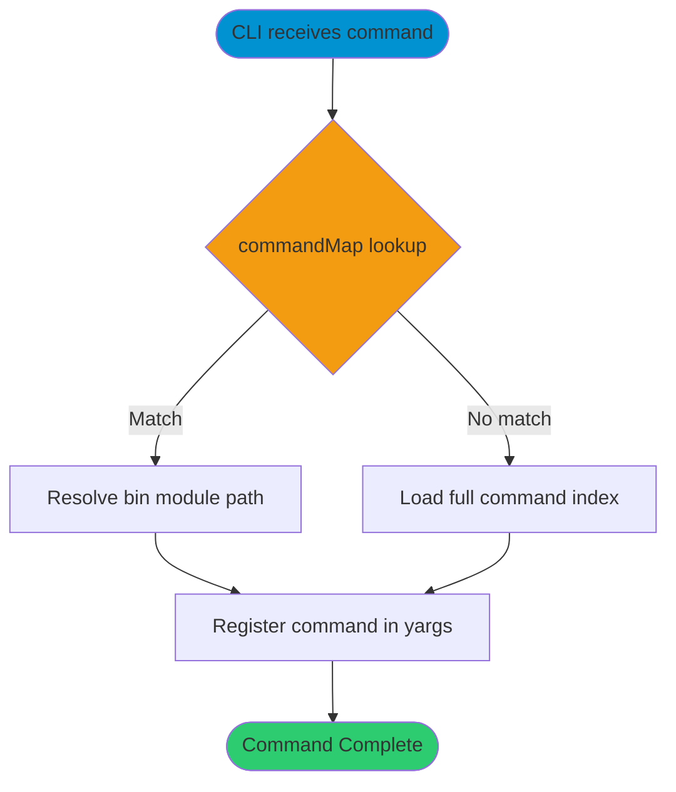

# commandMap

> Command: `commandMap` (internal module)  
> Category: **System Tools**  
> Status: Production Ready

## Description

Internal lazy-loading map used by the CLI to resolve command and alias names to implementation files in `bin/`.

## ⚠️ Redirect Notice

This is an internal runtime module, not a user-invokable command.

## Syntax

```bash
not a standalone CLI command
```

## Command Diagram



## Aliases

- No aliases

## Parameters

### Positional Arguments

| Parameter | Type | Description |
|-----------|------|-------------|
| `commandName` | string | Internal lookup key used by the CLI runtime |

### Options

| Option | Alias | Type | Default | Description |
|--------|-------|------|---------|-------------|
| - | - | - | - | No user-facing options; internal module only |

This module has no user-facing parameters.

Use the command list instead:

```bash
hana-cli --help
```

## Examples

### Basic Usage

```bash
hana-cli --help
```

Inspect available routed commands from the main CLI help.

## Related Commands

See the [Commands Reference](../all-commands.md) for other commands in this category.

## See Also

- [Category: System Tools](..)
- [All Commands A-Z](../all-commands.md)
