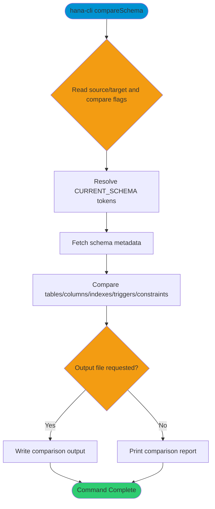

# compareSchema

> Command: `compareSchema`  
> Category: **System Tools**  
> Status: Production Ready

## ⚠️ Redirect Notice

This page is a legacy compatibility alias.

**👉 [Go to Compare Schema Documentation](../schema-tools/compare-schema.md)**

## Description

Compare the structure of two schemas (tables, columns, and optionally indexes, triggers, and constraints).

## Syntax

```bash
hana-cli compareSchema [options]
```

## Command Diagram



## Aliases

- `cmpschema`
- `schemaCompare`
- `compareschema`

## Parameters

### Options

| Option | Alias | Type | Default | Description |
|--------|-------|------|---------|-------------|
| `--sourceSchema` | `-s` | string | `**CURRENT_SCHEMA**` | Source schema to compare |
| `--targetSchema` | `-t` | string | `**CURRENT_SCHEMA**` | Target schema to compare |
| `--tables` | `-tb` | string | - | Optional table filter or pattern |
| `--compareIndexes` | `-ci` | boolean | `true` | Include index comparison |
| `--compareTriggers` | `-ct` | boolean | `true` | Include trigger comparison |
| `--compareConstraints` | `-cc` | boolean | `true` | Include constraint comparison |
| `--output` | `-o` | string | - | Output path for results |
| `--timeout` | `-to` | number | `3600` | Operation timeout in seconds |
| `--profile` | `-p` | string | - | Connection profile |

For a complete list of parameters and options, use:

```bash
hana-cli compareSchema --help
```

## Examples

### Basic Usage

```bash
hana-cli compareSchema --sourceSchema SCHEMA1 --targetSchema SCHEMA2
```

Compare two schemas and print structural differences.

## Related Commands

See the [Commands Reference](../all-commands.md) for other commands in this category.

## See Also

- [Category: System Tools](..)
- [All Commands A-Z](../all-commands.md)
