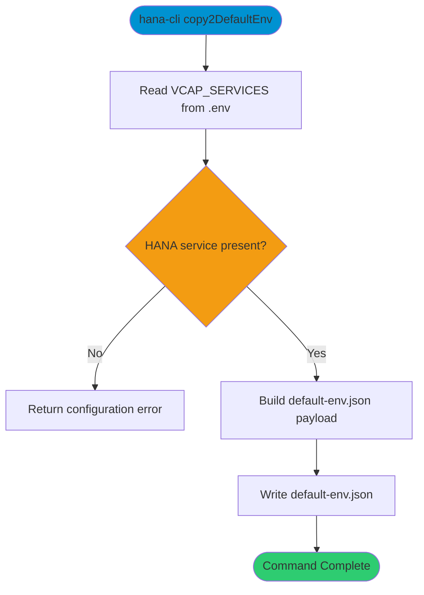

# copy2DefaultEnv

> Command: `copy2DefaultEnv`  
> Category: **System Tools**  
> Status: Production Ready

## Description

Copy .env contents to default-env.json and reformat

## Syntax

```bash
hana-cli copy2DefaultEnv [options]
```

## Command Diagram



## Aliases

- `copyDefaultEnv`
- `copyDefault-Env`
- `copy2defaultenv`
- `copydefaultenv`
- `copydefault-env`

## Parameters

### Options

| Option | Alias | Type | Default | Description |
|--------|-------|------|---------|-------------|
| - | - | - | - | No command-specific options |

For a complete list of parameters and options, use:

```bash
hana-cli copy2DefaultEnv --help
```

## Examples

### Basic Usage

```bash
hana-cli copy2DefaultEnv
```

Create or update `default-env.json` from the current `VCAP_SERVICES` environment.

## Related Commands

See the [Commands Reference](../all-commands.md) for other commands in this category.

## See Also

- [Category: System Tools](..)
- [All Commands A-Z](../all-commands.md)
