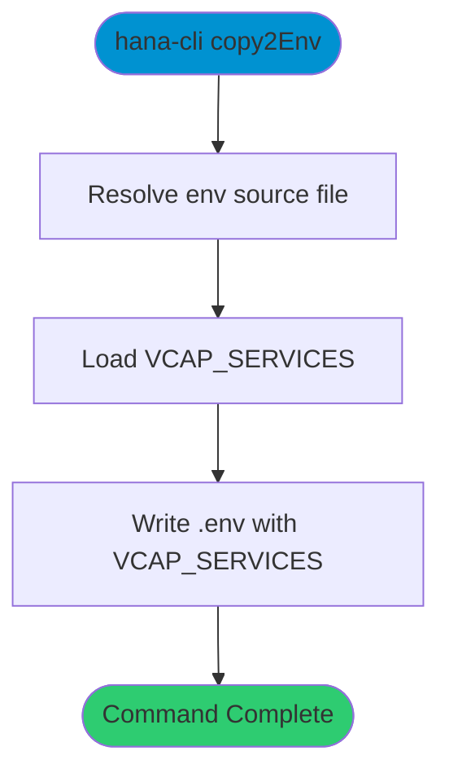

# copy2Env

> Command: `copy2Env`  
> Category: **System Tools**  
> Status: Production Ready

## Description

Copy default-env.json contents to .env and reformat

## Syntax

```bash
hana-cli copy2Env [options]
```

## Command Diagram



## Aliases

- `copyEnv`
- `copyenv`
- `copy2env`

## Parameters

### Options

| Option | Alias | Type | Default | Description |
|--------|-------|------|---------|-------------|
| - | - | - | - | No command-specific options |

For a complete list of parameters and options, use:

```bash
hana-cli copy2Env --help
```

## Examples

### Basic Usage

```bash
hana-cli copy2Env
```

Copy default-env.json contents to .env and reformat

## Related Commands

See the [Commands Reference](../all-commands.md) for other commands in this category.

## See Also

- [Category: System Tools](..)
- [All Commands A-Z](../all-commands.md)
