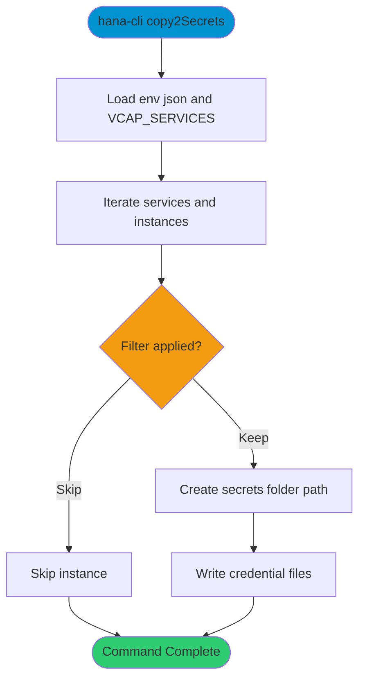

# copy2Secrets

> Command: `copy2Secrets`  
> Category: **System Tools**  
> Status: Production Ready

## Description

Create Kubernetes-style secret files from `VCAP_SERVICES` credentials (for example from `default-env.json`).

## Syntax

```bash
hana-cli copy2Secrets [options]
```

## Command Diagram



## Aliases

- `secrets`
- `make:secrets`

## Parameters

### Options

| Option | Alias | Type | Default | Description |
|--------|-------|------|---------|-------------|
| `--envJson` | `--from-file` | string | `default-env.json` | Source env file containing service bindings |
| `--secretsFolder` | `--to-folder` | string | `secrets` | Target folder for generated secret files |
| `--filter` | - | string | - | Optional filter for service instance names |

For a complete list of parameters and options, use:

```bash
hana-cli copy2Secrets --help
```

## Examples

### Basic Usage

```bash
hana-cli copy2Secrets
```

Generate secret files under the configured secrets folder.

## Related Commands

See the [Commands Reference](../all-commands.md) for other commands in this category.

## See Also

- [Category: System Tools](..)
- [All Commands A-Z](../all-commands.md)
