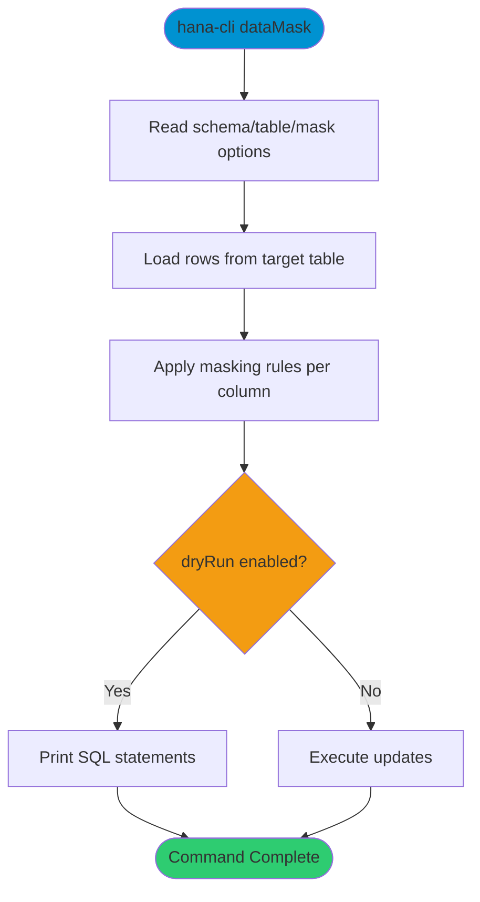

# dataMask

> Command: `dataMask`  
> Category: **System Tools**  
> Status: Production Ready

## Description

Apply masking rules for sensitive data protection

## Syntax

```bash
hana-cli dataMask [options]
```

## Command Diagram



## Aliases

- `mask`
- `dataprivacy`
- `anonymize`
- `pii`

## Parameters

### Options

| Option | Alias | Type | Default | Description |
|--------|-------|------|---------|-------------|
| `--schema` | `-s` | string | - | Schema containing target table |
| `--table` | `-t` | string | - | Target table to mask |
| `--rules` | `-r` | string | - | Inline masking rules definition |
| `--rulesFile` | `-rf` | string | - | Path to masking rules file |
| `--columns` | `-c` | string | - | Comma-separated columns to mask |
| `--maskType` | `-mt` | string | `redact` | Masking strategy. Choices: `redact`, `hash`, `shuffle`, `replace`, `truncate`, `pattern`, `random` |
| `--dryRun` | `-dr` | boolean | `true` | Generate masking SQL without executing |
| `--whereClause` | `-w` | string | - | Restrict rows to mask |
| `--output` | `-o` | string | - | Output file for generated SQL |
| `--profile` | `-p` | string | - | Connection profile |

For a complete list of parameters and options, use:

```bash
hana-cli dataMask --help
```

## Examples

### Basic Usage

```bash
hana-cli dataMask --table CUSTOMERS --maskType hash --columns EMAIL
```

Apply hash masking to matching rows and columns in the target table.

## Related Commands

See the [Commands Reference](../all-commands.md) for other commands in this category.

## See Also

- [Category: System Tools](..)
- [All Commands A-Z](../all-commands.md)
