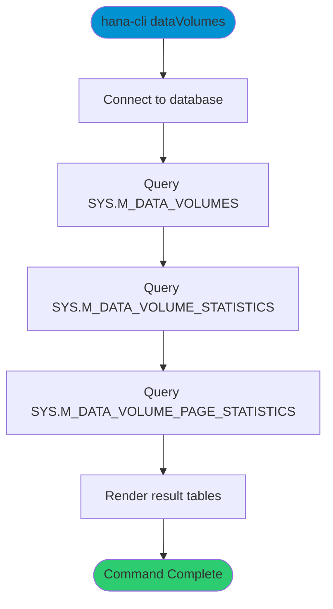

# dataVolumes

> Command: `dataVolumes`  
> Category: **System Tools**  
> Status: Production Ready

## Description

Inspect HANA data volume usage and statistics.

## Syntax

```bash
hana-cli dataVolumes [options]
```

## Command Diagram



## Aliases

- `dv`
- `datavolumes`

## Parameters

### Options

| Option | Alias | Type | Default | Description |
|--------|-------|------|---------|-------------|
| - | - | - | - | No command-specific options |

For a complete list of parameters and options, use:

```bash
hana-cli dataVolumes --help
```

## Examples

### Basic Usage

```bash
hana-cli dataVolumes
```

Show data volume, volume statistics, and page statistics.

## Related Commands

See the [Commands Reference](../all-commands.md) for other commands in this category.

## See Also

- [Category: System Tools](..)
- [All Commands A-Z](../all-commands.md)
