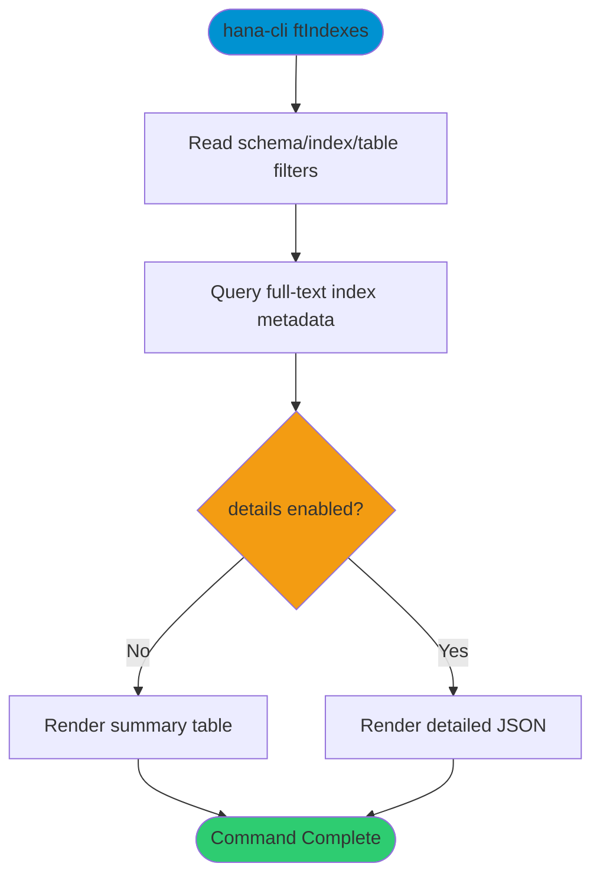

# ftIndexes

> Command: `ftIndexes`  
> Category: **System Tools**  
> Status: Production Ready

## Description

Inspect full-text indexes and related metadata.

## Syntax

```bash
hana-cli ftIndexes [schema] [index] [options]
```

## Command Diagram



## Aliases

- `fti`
- `ftIndex`
- `fulltext`
- `fulltextIndexes`

## Parameters

### Positional Arguments

| Parameter | Type | Description |
|-----------|------|-------------|
| `schema` | string | Schema filter (optional) |
| `index` | string | Full-text index filter (optional) |

### Options

| Option | Alias | Type | Default | Description |
|--------|-------|------|---------|-------------|
| `--index` | `-i` | string | `*` | Full-text index name/pattern |
| `--schema` | `-s` | string | `**CURRENT_SCHEMA**` | Schema name |
| `--table` | `-t` | string | - | Table filter |
| `--details` | `-d` | boolean | `false` | Include detailed output |
| `--limit` | `-l` | number | `200` | Maximum rows returned |
| `--profile` | `-p` | string | - | Connection profile |

For a complete list of parameters and options, use:

```bash
hana-cli ftIndexes --help
```

## Examples

### Basic Usage

```bash
hana-cli ftIndexes --index myIndex --schema MYSCHEMA
```

List matching full-text indexes in the selected schema.

## Related Commands

See the [Commands Reference](../all-commands.md) for other commands in this category.

## See Also

- [Category: System Tools](..)
- [All Commands A-Z](../all-commands.md)
