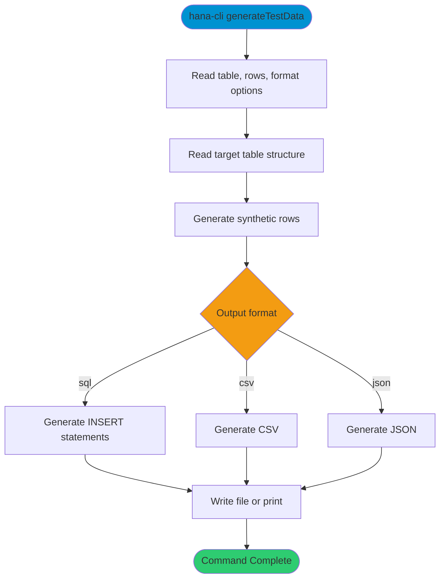

# generateTestData

> Command: `generateTestData`  
> Category: **System Tools**  
> Status: Production Ready

## Description

Generate realistic sample data for a table and output it as SQL, CSV, or JSON.

## Syntax

```bash
hana-cli generateTestData [options]
```

## Command Diagram



## Aliases

- `testdata`
- `gendata`
- `generateData`

## Parameters

For a complete list of parameters and options, use:

```bash
hana-cli generateTestData --help
```

### Options

| Option | Alias | Type | Default | Description |
|--------|-------|------|---------|-------------|
| `--table` | `-t` | string | - | Target table name |
| `--schema` | `-s` | string | - | Schema name |
| `--rows` | `-r` | number | `100` | Number of rows to generate |
| `--locale` | `-l` | string | `en` | Locale for generated values |
| `--seed` | `-sd` | number | - | Random seed for reproducibility |
| `--format` | `-f` | string | `sql` | Output format. Choices: `sql`, `csv`, `json` |
| `--output` | `-o` | string | - | Output file path |
| `--realistic` | `-x` | boolean | `true` | Generate realistic values |
| `--includeRelations` | `-rel` | boolean | `true` | Include relation-aware generation |
| `--dryRun` | `-dr` | boolean | `false` | Dry-run mode |
| `--profile` | `-p` | string | - | Connection profile |

## Examples

### Basic Usage

```bash
hana-cli generateTestData --table MY_TABLE --rows 100 --format sql
```

Generate sample rows and output SQL insert statements.

## Related Commands

See the [Commands Reference](../all-commands.md) for other commands in this category.

## See Also

- [Category: System Tools](..)
- [All Commands A-Z](../all-commands.md)
