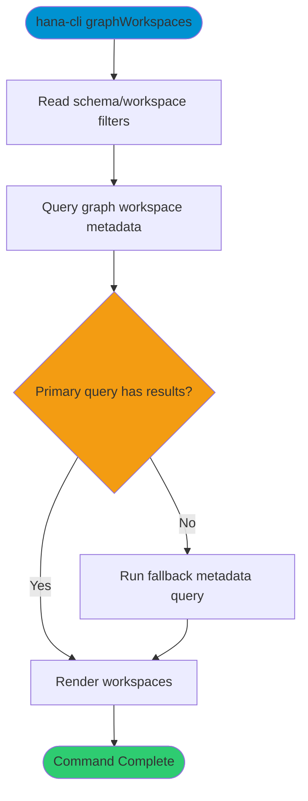

# graphWorkspaces

> Command: `graphWorkspaces`  
> Category: **System Tools**  
> Status: Production Ready

## Description

List graph workspaces and related metadata.

## Syntax

```bash
hana-cli graphWorkspaces [schema] [workspace] [options]
```

## Command Diagram



## Aliases

- `gws`
- `graphs`
- `graphWorkspace`
- `graphws`

## Parameters

### Positional Arguments

| Parameter | Type | Description |
|-----------|------|-------------|
| `schema` | string | Schema filter (optional) |
| `workspace` | string | Workspace filter (optional) |

### Options

| Option | Alias | Type | Default | Description |
|--------|-------|------|---------|-------------|
| `--workspace` | `-w` | string | `*` | Graph workspace name/pattern |
| `--schema` | `-s` | string | `**CURRENT_SCHEMA**` | Schema name |
| `--limit` | `-l` | number | `200` | Maximum rows returned |
| `--profile` | `-p` | string | - | Connection profile |

For a complete list of parameters and options, use:

```bash
hana-cli graphWorkspaces --help
```

## Examples

### Basic Usage

```bash
hana-cli graphWorkspaces --workspace myWorkspace --schema MYSCHEMA
```

List graph workspaces that match the provided filters.

## Related Commands

See the [Commands Reference](../all-commands.md) for other commands in this category.

## See Also

- [Category: System Tools](..)
- [All Commands A-Z](../all-commands.md)
