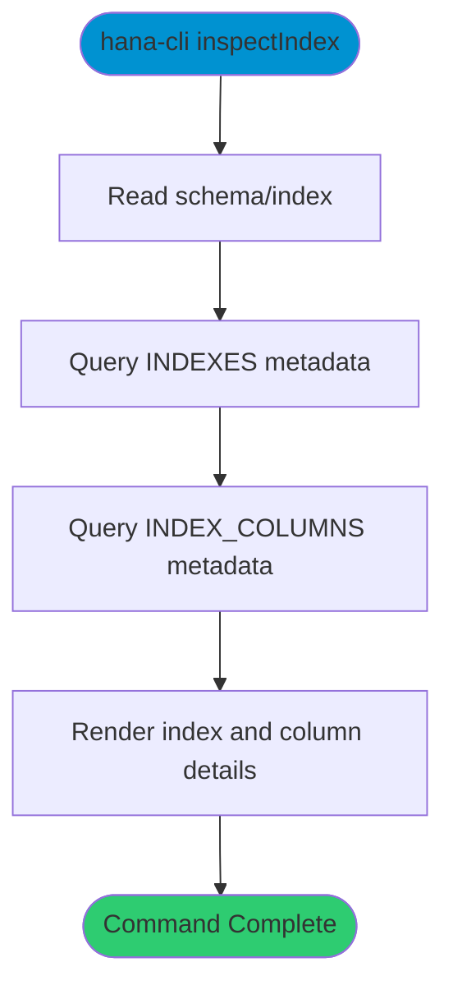

# inspectIndex

> Command: `inspectIndex`  
> Category: **System Tools**  
> Status: Production Ready

## Description

Return metadata about an index.

## Syntax

```bash
hana-cli inspectIndex [schema] [index] [options]
```

## Command Diagram



## Aliases

- `ii`
- `index`
- `insIndex`
- `inspectindex`

## Parameters

### Positional Arguments

| Parameter | Type | Description |
|-----------|------|-------------|
| `schema` | string | Schema name (optional) |
| `index` | string | Index name (optional) |

### Options

| Option | Alias | Type | Default | Description |
|--------|-------|------|---------|-------------|
| `--index` | `-i` | string | - | Index name |
| `--schema` | `-s` | string | `**CURRENT_SCHEMA**` | Schema name |

For a complete list of parameters and options, use:

```bash
hana-cli inspectIndex --help
```

## Examples

### Basic Usage

```bash
hana-cli inspectIndex --index myIndex --schema MYSCHEMA
```

Show index definition and indexed columns.

## Related Commands

See the [Commands Reference](../all-commands.md) for other commands in this category.

## See Also

- [Category: System Tools](..)
- [All Commands A-Z](../all-commands.md)
