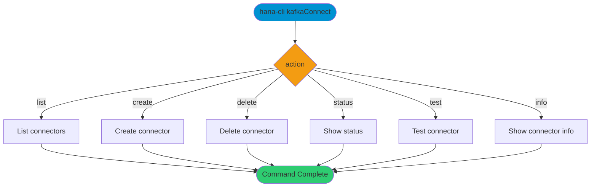

# kafkaConnect

> Command: `kafkaConnect`  
> Category: **System Tools**  
> Status: Production Ready

## Description

The `kafkaConnect` command performs operations related to system tools.

## Syntax

```bash
hana-cli kafkaConnect [options]
```

## Command Diagram



## Aliases

- `kafka`
- `kafkaAdapter`
- `kafkasub`

## Parameters

### Positional Arguments

| Parameter | Type | Description |
|-----------|------|-------------|
| `action` | string | Operation to perform. Choices: `list`, `create`, `delete`, `status`, `test`, `info` |

### Options

| Option | Alias | Type | Default | Description |
|--------|-------|------|---------|-------------|
| `--action` | `-a` | string | `list` | Connector action. Choices: `list`, `create`, `delete`, `status`, `test`, `info` |
| `--name` | `-n` | string | - | Connector name |
| `--brokers` | `-b` | string | - | Kafka brokers list |
| `--topic` | `-t` | string | - | Kafka topic |
| `--config` | `-c` | string | - | Configuration file path |

## Examples

### Basic Usage

```bash
hana-cli kafkaConnect
```

For more examples, run:

```bash
hana-cli kafkaConnect --help
```

## Documentation

For detailed command documentation, parameters, and examples, use:

```bash
hana-cli kafkaConnect --help
```

## Related Commands

- [All Commands A-Z](../all-commands.md)
- [Commands Overview](..)

## See Also

- [Category: System Tools](..)
- [Command Reference](../all-commands.md)
