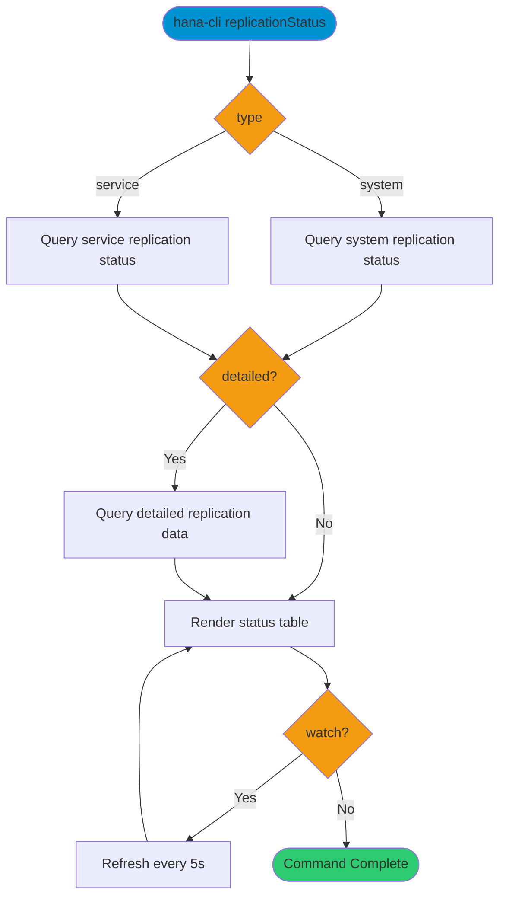

# replicationStatus

> Command: `replicationStatus`  
> Category: **System Tools**  
> Status: Production Ready

## Description

Monitors SAP HANA system replication status. This command displays real-time information about system replication sites, services, and replication lag, which is essential for high availability and disaster recovery monitoring.

## Syntax

```bash
hana-cli replicationStatus [options]
```

## Command Diagram



## Aliases

- `replstatus`
- `replication`
- `replstat`

## Parameters

### Options

| Option | Alias | Type | Default | Description |
|--------|-------|------|---------|-------------|
| `--type` | `-ty` | string | `system` | Replication mode. Choices: `system`, `service` |
| `--serviceName` | `-sn` | string | - | Filter by service name (for `service` mode) |
| `--detailed` | `-d` | boolean | `false` | Include detailed replication output |
| `--watch` | `-w` | boolean | `false` | Refresh continuously every 5 seconds |
| `--profile` | `-p` | string | - | Connection profile |

For a complete list of parameters and options, use:

```bash
hana-cli replicationStatus --help
```

## Replication Modes

- **PRIMARY**: Primary site
- **SYNC**: Synchronous replication
- **SYNCMEM**: Synchronous in-memory replication
- **ASYNC**: Asynchronous replication

## Replication Status Values

- **ACTIVE**: Replication is running normally
- **SYNCING**: Initial synchronization in progress
- **ERROR**: Replication encountered an error
- **UNKNOWN**: Status cannot be determined
- **NOT_CONFIGURED**: System replication not set up

## Output Format

### System Replication Output

```text
Checking system replication status
Found 2 replication site(s)

┌─────────┬───────────┬───────────┬───────┬──────────────────┬────────────────────┬──────────────────────────┬──────────────────────────┬────────────────────────┐
│ SITE_ID │ SITE_NAME │ HOST      │ PORT  │ REPLICATION_MODE │ REPLICATION_STATUS │ SHIPPED_LOG_POSITION_TIME│ LAST_LOG_POSITION_TIME   │ SECONDARY_ACTIVE_STATUS│
├─────────┼───────────┼───────────┼───────┼──────────────────┼────────────────────┼──────────────────────────┼──────────────────────────┼────────────────────────┤
│ 1       │ PRIMARY   │ hana-prod │ 30013 │ PRIMARY          │ ACTIVE             │ 2026-02-16 14:30:45      │ 2026-02-16 14:30:45      │ YES                    │
│ 2       │ SECONDARY │ hana-dr   │ 30013 │ SYNCMEM          │ ACTIVE             │ 2026-02-16 14:30:43      │ 2026-02-16 14:30:45      │ YES                    │
└─────────┴───────────┴───────────┴───────┴──────────────────┴────────────────────┴──────────────────────────┴──────────────────────────┴────────────────────────┘
```

### Service Replication Output

```text
┌──────────────┬────────────────────┬────────────────────┬───────────────────┬──────────────────┐
│ SERVICE_NAME │ REPLICATION_STATUS │ SHIPPED_SAVE_COUNT │ REPLAY_BACKLOG_SIZE│ LAST_UPDATE_TIME │
├──────────────┼────────────────────┼────────────────────┼───────────────────┼──────────────────┤
│ indexserver  │ ACTIVE             │ 524288             │ 0                 │ 2026-02-16 14:30 │
│ nameserver   │ ACTIVE             │ 98765              │ 0                 │ 2026-02-16 14:30 │
│ xsengine     │ ACTIVE             │ 45123              │ 256               │ 2026-02-16 14:29 │
└──────────────┴────────────────────┴────────────────────┴───────────────────┴──────────────────┘
```

### Detailed Information Output

When using `-d` flag:

```text
Detailed Replication Information

┌───────────────┬────────────────┬───────────────────┬──────────────────┬────────────────┬─────────────────────────┬───────────────────────┬────────────────────┐
│ SECONDARY_HOST│ SECONDARY_PORT │ SECONDARY_SITE_NAME│ REPLICATION_MODE │ OPERATION_MODE │ SHIPPED_LOG_BUFFERS_COUNT│SHIPPED_LOG_BUFFERS_SIZE│ ASYNC_BUFFER_USAGE │
├───────────────┼────────────────┼───────────────────┼──────────────────┼────────────────┼─────────────────────────┼───────────────────────┼────────────────────┤
│ hana-dr       │ 30001          │ SECONDARY         │ SYNCMEM          │ logreplay      │ 1024                    │ 67108864              │ 12.5%              │
└───────────────┴────────────────┴───────────────────┴──────────────────┴────────────────┴─────────────────────────┴───────────────────────┴────────────────────┘
```

## Examples

### 1. Check System Replication Status

Display system replication overview:

```bash
hana-cli replicationStatus
```

Or explicitly:

```bash
hana-cli replicationStatus -ty system
```

### 2. Check Service Replication

Monitor service-specific replication:

```bash
hana-cli replicationStatus -ty service
```

### 3. Filter by Service Name

Check replication for a specific service:

```bash
hana-cli replicationStatus -ty service -sn indexserver
```

### 4. Detailed Replication Information

Show detailed replication metrics:

```bash
hana-cli replicationStatus -d
```

### 5. Continuous Monitoring (Watch Mode)

Monitor replication status in real-time:

```bash
hana-cli replicationStatus -w
```

Press Ctrl+C to exit watch mode.

### 6. Combined Options

Monitor specific service with details:

```bash
hana-cli replicationStatus \
  -ty service \
  -sn nameserver \
  -d
```

## Use Cases

1. **High Availability Monitoring**: Monitor replication health in HA environments
2. **Disaster Recovery**: Ensure DR site is properly synchronized
3. **Performance Analysis**: Check replication lag and buffer usage
4. **Troubleshooting**: Diagnose replication issues and bottlenecks
5. **Compliance**: Verify replication meets RTO/RPO requirements
6. **Operations Dashboard**: Continuous monitoring in watch mode

## Related System Views

The command queries these HANA system views:

- `SYS.M_SERVICE_REPLICATION` - Service replication status
- `SYS.M_SERVICE_REPLICATION_STATISTICS` - Replication statistics

## Prerequisites

- SAP HANA System Replication configured (for meaningful data)
- Appropriate database privileges to query replication views
- Primary and secondary systems must be accessible

## Notes

- System must have System Replication configured to see meaningful data
- If replication is not configured, the command shows `NOT_CONFIGURED` status
- Watch mode is useful for monitoring during failover or takeover operations
- Replication lag can be calculated from log position timestamps
- Requires appropriate system privileges to query replication views
- Use detailed mode to diagnose performance issues with replication

## Troubleshooting

If you see errors or empty results:

1. Verify system replication is configured
2. Check database privileges
3. Ensure you're connected to the primary or secondary system
4. Review HANA replication configuration settings

## Related Commands

See the [Commands Reference](../all-commands.md) for other commands in this category.

## See Also

- [Category: System Tools](..)
- [All Commands A-Z](../all-commands.md)
