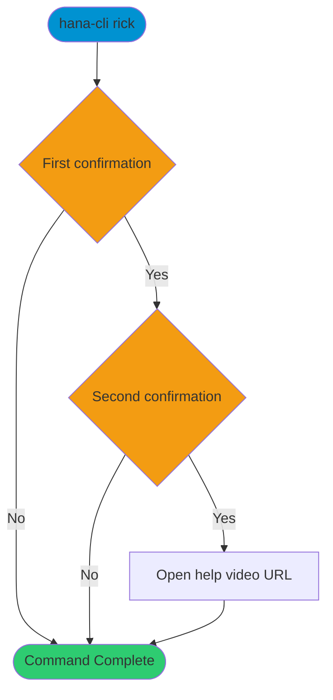

# rick

> Command: `rick`  
> Category: **System Tools**  
> Status: Production Ready

## Description

Interactive easter-egg command for expert users.

## Syntax

```bash
hana-cli rick [options]
```

## Command Diagram



## Aliases

- No aliases

## Parameters

### Options

| Option | Alias | Type | Default | Description |
|--------|-------|------|---------|-------------|
| `--help` | `-h` | boolean | `false` | Show command help |

For a complete list of parameters and options, use:

```bash
hana-cli rick --help
```

## Examples

### Basic Usage

```bash
hana-cli rick
```

Run the interactive confirmation flow.

## Related Commands

See the [Commands Reference](../all-commands.md) for other commands in this category.

## See Also

- [Category: System Tools](..)
- [All Commands A-Z](../all-commands.md)
