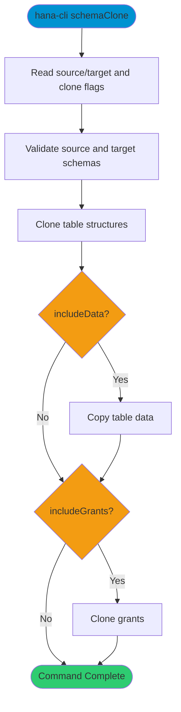

# schemaClone

> Command: `schemaClone`  
> Category: **System Tools**  
> Status: Production Ready

## Description

Clone entire schema with or without data

## Syntax

```bash
hana-cli schemaClone [options]
```

## Command Diagram



## Aliases

- `schemaclone`
- `cloneSchema`
- `copyschema`

## Parameters

For a complete list of parameters and options, use:

```bash
hana-cli schemaClone --help
```

### Options

| Option | Alias | Type | Default | Description |
|--------|-------|------|---------|-------------|
| `--sourceSchema` | `-ss` | string | `**CURRENT_SCHEMA**` | Source schema to clone |
| `--targetSchema` | `-ts` | string | `**CURRENT_SCHEMA**` | Target schema |
| `--includeData` | `-id` | boolean | `false` | Clone table data |
| `--includeGrants` | `-ig` | boolean | `false` | Clone grants |
| `--parallel` | `-par` | number | `1` | Parallel workers |
| `--excludeTables` | `-et` | string | - | Comma-separated tables to skip |
| `--dryRun` | `-dr`, `--preview` | boolean | `false` | Preview operations only |
| `--timeout` | `-to` | number | `7200` | Operation timeout in seconds |
| `--profile` | `-p` | string | - | Connection profile |

## Examples

### Basic Usage

```bash
hana-cli schemaClone --sourceSchema SOURCE --targetSchema TARGET --includeData
```

Clone entire schema with or without data

## Related Commands

See the [Commands Reference](../all-commands.md) for other commands in this category.

## See Also

- [Category: System Tools](..)
- [All Commands A-Z](../all-commands.md)
