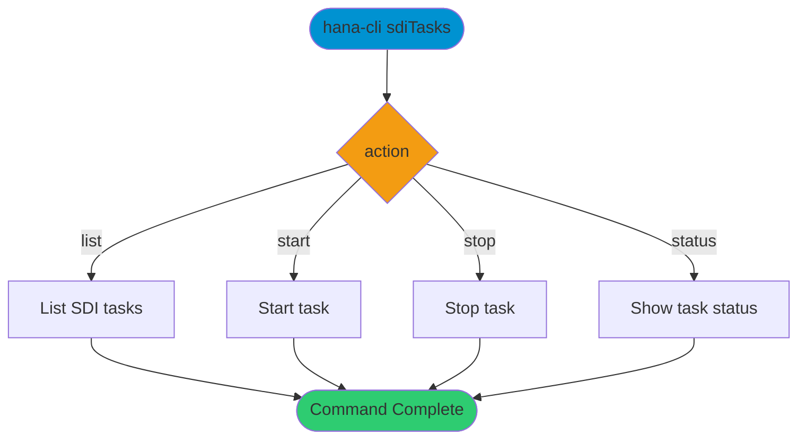

# sdiTasks

> Command: `sdiTasks`  
> Category: **System Tools**  
> Status: Production Ready

## Description

Manages Smart Data Integration (SDI) tasks and flowgraphs in SAP HANA. This command allows you to list, start, stop, and monitor SDI tasks for data integration scenarios.

## Syntax

```bash
hana-cli sdiTasks [options]
```

## Command Diagram



## Aliases

- `sditasks`
- `sdi`
- `smartDataIntegration`

## Parameters

### Options

| Option | Alias | Type | Default | Description |
|--------|-------|------|---------|-------------|
| `--action` | `-a` | string | `list` | Action. Choices: `list`, `start`, `stop`, `status` |
| `--taskName` | `-tn` | string | - | SDI task name (required for `start`, `stop`, `status`) |
| `--flowgraph` | `-fg` | string | - | Flowgraph name filter |
| `--agentName` | `-an` | string | - | SDI agent filter |
| `--schema` | `-s` | string | `**CURRENT_SCHEMA**` | Schema name |
| `--profile` | `-p` | string | - | Connection profile |

For a complete list of parameters and options, use:

```bash
hana-cli sdiTasks --help
```

## Output Format

### List Action Output

```text
Found 3 SDI task(s)

┌─────────────────────┬──────────────────┬──────────┬───────────────┬───────────────────┬─────────────────┐
│ TASK_NAME           │ FLOWGRAPH_NAME   │ STATUS   │ AGENT_NAME    │ LAST_START_TIME   │ LAST_END_TIME   │
├─────────────────────┼──────────────────┼──────────┼───────────────┼───────────────────┼─────────────────┤
│ CUSTOMER_SYNC       │ SYNC_FLOWGRAPH   │ ACTIVE   │ DEFAULT_AGENT │ 2026-02-16 10:30  │ NULL            │
│ ORDER_REPLICATION   │ ORDER_FG         │ INACTIVE │ AGENT_002     │ 2026-02-15 22:00  │ 2026-02-15 23:15│
│ PRODUCT_IMPORT      │ IMPORT_FG        │ ACTIVE   │ DEFAULT_AGENT │ 2026-02-16 08:00  │ NULL            │
└─────────────────────┴──────────────────┴──────────┴───────────────┴───────────────────┴─────────────────┘
```

### Status Action Output

```text
┌─────────────────────┬──────────┬───────────────────┬─────────────────┬───────────────┐
│ TASK_NAME           │ STATUS   │ LAST_START_TIME   │ LAST_END_TIME   │ ERROR_MESSAGE │
├─────────────────────┼──────────┼───────────────────┼─────────────────┼───────────────┤
│ CUSTOMER_SYNC       │ RUNNING  │ 2026-02-16 10:30  │ NULL            │ NULL          │
└─────────────────────┴──────────┴───────────────────┴─────────────────┴───────────────┘
```

## Examples

### 1. List All SDI Tasks

Display all SDI tasks in current schema:

```bash
hana-cli sdiTasks
```

Or explicitly:

```bash
hana-cli sdiTasks -a list
```

### 2. Start an SDI Task

Start a specific task:

```bash
hana-cli sdiTasks -a start -tn MY_REPLICATION_TASK
```

### 3. Stop an SDI Task

Stop a running task:

```bash
hana-cli sdiTasks -a stop -tn MY_REPLICATION_TASK
```

### 4. Check Task Status

Get detailed status of a specific task:

```bash
hana-cli sdiTasks -a status -tn MY_REPLICATION_TASK
```

### 5. List Tasks in Specific Schema

View tasks in a specific schema:

```bash
hana-cli sdiTasks -s DATA_INTEGRATION
```

### 6. Filter by Agent Name

List tasks for a specific SDI agent:

```bash
hana-cli sdiTasks -an AGENT_001
```

## Use Cases

1. **Task Management**: Start, stop, and monitor SDI replication tasks
2. **Status Monitoring**: Check health and status of data integration workflows
3. **Troubleshooting**: Identify failed or stuck SDI tasks
4. **Automation**: Script SDI task control for scheduled operations
5. **Multi-Agent Management**: Manage tasks across different SDI agents
6. **Operational Visibility**: View all active data integration processes

## Related System Views

The command queries these HANA system views:

- `SYS.DI_TASKS` - SDI task definitions and state

## Prerequisites

- SAP HANA Smart Data Integration configured
- SDI agent(s) installed and running
- Appropriate database privileges for SDI operations
- Valid flowgraphs deployed in the schema

## Notes

- SDI must be properly configured in your HANA system to use this command
- Task names are case-sensitive
- The `list` action queries the `SYS.DI_TASKS` system view
- Starting/stopping tasks requires appropriate database privileges
- If SDI tables are not available, sample data is shown for command testing
- Use status action to monitor long-running integration tasks

## Related Commands

See the [Commands Reference](../all-commands.md) for other commands in this category.

## See Also

- [Category: System Tools](..)
- [All Commands A-Z](../all-commands.md)
