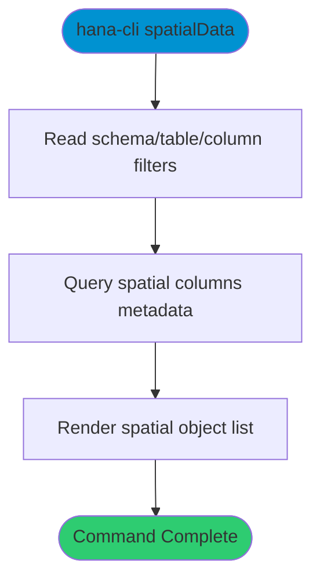

# spatialData

> Command: `spatialData`  
> Category: **System Tools**  
> Status: Production Ready

## Description

Inspect spatial/geographic columns and metadata.

## Syntax

```bash
hana-cli spatialData [schema] [table] [options]
```

## Command Diagram



## Aliases

- `spatial`
- `geoData`
- `geographic`
- `geo`

## Parameters

### Positional Arguments

| Parameter | Type | Description |
|-----------|------|-------------|
| `schema` | string | Schema filter (optional) |
| `table` | string | Table filter (optional) |

### Options

| Option | Alias | Type | Default | Description |
|--------|-------|------|---------|-------------|
| `--table` | `-t` | string | `*` | Table name/pattern |
| `--schema` | `-s` | string | `**CURRENT_SCHEMA**` | Schema name |
| `--column` | `-c` | string | - | Spatial column filter |
| `--bounds` | `-b` | boolean | `false` | Include bounds output |
| `--limit` | `-l` | number | `200` | Maximum rows returned |
| `--profile` | `-p` | string | - | Connection profile |

For a complete list of parameters and options, use:

```bash
hana-cli spatialData --help
```

## Examples

### Basic Usage

```bash
hana-cli spatialData --schema MYSCHEMA --table % --bounds
```

List spatial columns for matching tables in the selected schema.

## Related Commands

See the [Commands Reference](../all-commands.md) for other commands in this category.

## See Also

- [Category: System Tools](..)
- [All Commands A-Z](../all-commands.md)
