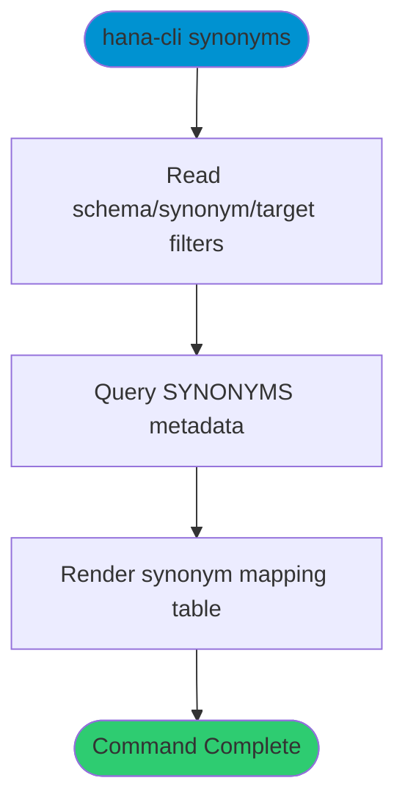

# synonyms

> Command: `synonyms`  
> Category: **System Tools**  
> Status: Production Ready

## Description

List and inspect synonyms and their target objects.

## Syntax

```bash
hana-cli synonyms [schema] [synonym] [target] [options]
```

## Command Diagram



## Aliases

- `syn`
- `listSynonyms`
- `listsynonyms`

## Parameters

### Positional Arguments

| Parameter | Type | Description |
|-----------|------|-------------|
| `schema` | string | Schema filter (optional) |
| `synonym` | string | Synonym name/pattern (optional) |
| `target` | string | Target object name/pattern (optional) |

### Options

| Option | Alias | Type | Default | Description |
|--------|-------|------|---------|-------------|
| `--synonym` | `--syn` | string | `*` | Synonym filter |
| `--target` | `-t` | string | `*` | Target object filter |
| `--schema` | `-s` | string | `**CURRENT_SCHEMA**` | Schema name |
| `--limit` | `-l` | number | `200` | Maximum rows returned |

For a complete list of parameters and options, use:

```bash
hana-cli synonyms --help
```

## Examples

### Basic Usage

```bash
hana-cli synonyms --schema MYSCHEMA --synonym %
```

List synonyms and their target objects in the selected schema.

## Related Commands

See the [Commands Reference](../all-commands.md) for other commands in this category.

## See Also

- [Category: System Tools](..)
- [All Commands A-Z](../all-commands.md)
