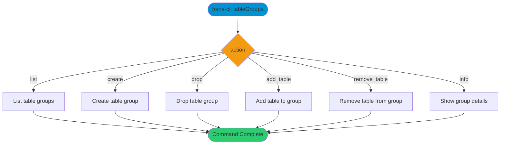

# tableGroups

> Command: `tableGroups`  
> Category: **System Tools**  
> Status: Production Ready

## Description

Manage table groups (list, create, drop, and membership actions).

## Syntax

```bash
hana-cli tableGroups [action] [groupName] [options]
```

## Command Diagram



## Aliases

- `tg`
- `tablegroup`
- `groups`
- `groups-tables`

## Parameters

### Positional Arguments

| Parameter | Type | Description |
|-----------|------|-------------|
| `action` | string | Action to perform (optional) |
| `groupName` | string | Table group name (optional) |

### Options

| Option | Alias | Type | Default | Description |
|--------|-------|------|---------|-------------|
| `--action` | `-a` | string | `list` | Action selector |
| `--groupName` | `-g`, `--group` | string | - | Table group name |
| `--schema` | `-s` | string | `**CURRENT_SCHEMA**` | Schema name |
| `--table` | `-t` | string | - | Table name |
| `--type` | - | string | - | Table group type |
| `--subtype` | - | string | - | Table group subtype |
| `--matchSchema` | - | string | - | Match schema pattern |
| `--matchTable` | - | string | - | Match table pattern |
| `--limit` | `-l` | number | `200` | Maximum rows returned |
| `--profile` | `-p` | string | - | Connection profile |

For a complete list of parameters and options, use:

```bash
hana-cli tableGroups --help
```

## Examples

### Basic Usage

```bash
hana-cli tableGroups --action list --schema MYSCHEMA
```

List table groups in the selected schema.

## Related Commands

See the [Commands Reference](../all-commands.md) for other commands in this category.

## See Also

- [Category: System Tools](..)
- [All Commands A-Z](../all-commands.md)
