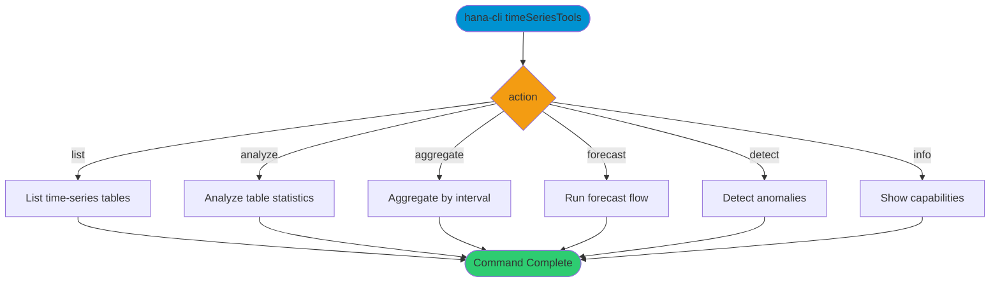

# timeSeriesTools

> Command: `timeSeriesTools`  
> Category: **System Tools**  
> Status: Production Ready

## Description

Analyze and operate on time-series data.

## Syntax

```bash
hana-cli timeSeriesTools [action] [options]
```

## Command Diagram



## Aliases

- `tsTools`
- `timeseries`
- `timeseriestools`

## Parameters

### Positional Arguments

| Parameter | Type | Description |
|-----------|------|-------------|
| `action` | string | Action to perform |

### Options

| Option | Alias | Type | Default | Description |
|--------|-------|------|---------|-------------|
| `--action` | `-a` | string | `list` | Action. Choices: `list`, `analyze`, `aggregate`, `forecast`, `detect`, `info` |
| `--table` | `-t`, `--Table` | string | - | Target table |
| `--table` | `-t` | string | - | Target table |
| `--schema` | `-s` | string | `**CURRENT_SCHEMA**` | Schema name |
| `--timeColumn` | `--tc` | string | - | Timestamp column |
| `--valueColumn` | `--vc` | string | - | Numeric value column |
| `--interval` | `-i` | string | `HOUR` | Aggregation interval. Choices: `SECOND`, `MINUTE`, `HOUR`, `DAY`, `WEEK`, `MONTH` |
| `--limit` | `-l` | number | `1000` | Maximum rows returned |

For a complete list of parameters and options, use:

```bash
hana-cli timeSeriesTools --help
```

## Examples

### Basic Usage

```bash
hana-cli timeSeriesTools --action analyze --table TIMESERIES_DATA
```

Run the analyze action for the specified time-series table.

## Related Commands

See the [Commands Reference](../all-commands.md) for other commands in this category.

## See Also

- [Category: System Tools](..)
- [All Commands A-Z](../all-commands.md)
