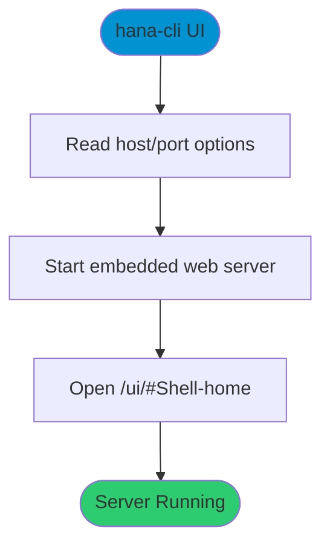

# UI

> Command: `UI`  
> Category: **System Tools**  
> Status: Production Ready

## Description

Launch the browser-based UI for hana-cli.

## Syntax

```bash
hana-cli UI [options]
```

## Command Diagram



## Aliases

- `ui`
- `gui`
- `GUI`
- `launchpad`
- `LaunchPad`
- `launchPad`
- `server`

## Parameters

### Options

| Option | Alias | Type | Default | Description |
|--------|-------|------|---------|-------------|
| `--port` | `-p` | number | `3010` | Server port |
| `--host` | - | string | `localhost` | Server host/interface |

For a complete list of parameters and options, use:

```bash
hana-cli UI --help
```

## Examples

### Basic Usage

```bash
hana-cli UI
```

Start the browser-based UI experience.

## Related Commands

See the [Commands Reference](../all-commands.md) for other commands in this category.

## See Also

- [Category: System Tools](..)
- [All Commands A-Z](../all-commands.md)
