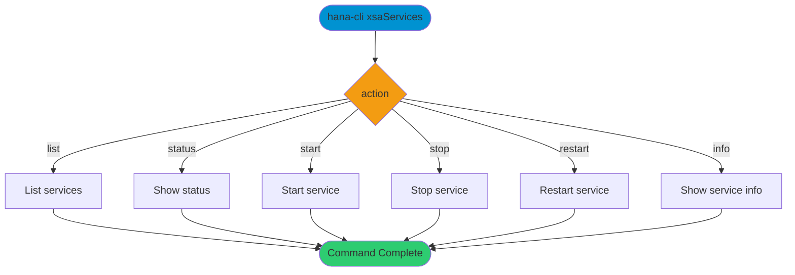

# xsaServices

> Command: `xsaServices`  
> Category: **System Tools**  
> Status: Production Ready

## Description

Enhanced management of XSA (Extended Services Architecture) services in your SAP HANA environment. Use this command to monitor, control, and manage XSA services across your system.

## Syntax

```bash
hana-cli xsaServices [action] [options]
```

## Command Diagram



## Aliases

- `xsa`
- `xsaSvc`
- `xsaservices`

## Parameters

### Positional Arguments

| Parameter | Type | Description |
|-----------|------|-------------|
| `action` | string | Action selector |

### Options

| Option | Alias | Type | Default | Description |
|--------|-------|------|---------|-------------|
| `--action` | `-a` | string | `list` | Action. Choices: `list`, `status`, `start`, `stop`, `restart`, `info` |
| `--service` | `-sv` | string | - | Service name (required for start/stop/restart) |
| `--details` | `-d` | boolean | `false` | Include detailed information |

For a complete list of parameters and options, use:

```bash
hana-cli xsaServices --help
```

## Actions

- **list** (default): Display all XSA services
- **status**: Get current status of XSA services
- **start**: Start a specific XSA service
- **stop**: Stop a specific XSA service
- **restart**: Restart a specific XSA service
- **info**: Get detailed information about XSA services

## Legacy Option Notes

### Positional Parameters

- **action** (string): Action to perform (list, status, start, stop, restart, info)
  - Default: `list`
  - Alias: `-a, --Action`
  - Choices: `list`, `status`, `start`, `stop`, `restart`, `info`

### Optional Parameters

- **--service, -sv** (string): XSA Service Name
  - Alias: `--Service`
  - Required for: `start`, `stop`, `restart` actions

- **--details, -d** (boolean): Display detailed information
  - Default: `false`
  - Alias: `--Details`

## Examples

### 1. List All XSA Services

```bash
hana-cli xsaServices list
```

### 2. Check Service Status

```bash
hana-cli xsa status
```

### 3. Start a Specific Service

```bash
hana-cli xsaServices start --service myservice
```

### 4. Restart a Service with Details

```bash
hana-cli xsa restart -sv myservice --details
```

### 5. Get Service Information

```bash
hana-cli xsaServices info --details
```

Run the selected XSA service action.

## Output

### List Action

Returns all XSA services with:

- Service name
- Component name
- Active status
- Startup type
- Creation time

### Status Action

Returns service status including:

- Service name
- Active status
- Startup type
- Memory usage
- CPU usage

### Start/Stop/Restart Actions

Displays operation result and confirmation message.

## Use Cases

- **Service Monitoring**: Track health and status of XSA services
- **Performance Management**: Monitor service resource usage
- **Troubleshooting**: Start, stop, or restart services to resolve issues
- **Maintenance Window**: Manage services during system updates

## Related Commands

- `containers` - Manage HDI containers
- `systemInfo` - Get overall system information
- `status` - Get database connection status

See the [Commands Reference](../all-commands.md) for other commands in this category.

## Notes

- Start/stop/restart operations may require administrative privileges
- Some services may take time to start or stop
- Service status reflects the current operational state
- Details flag provides additional metadata about services

## See Also

- [Category: System Tools](..)
- [All Commands A-Z](../all-commands.md)
