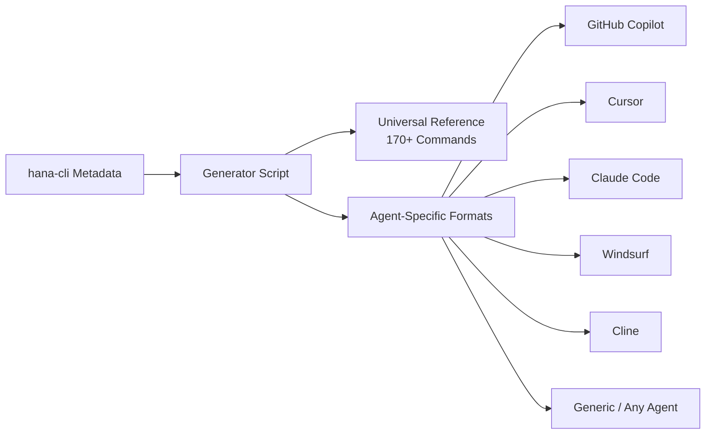

# Agent Instructions — Portable AI Assistant Knowledge

Teach any AI coding assistant how to use hana-cli in your SAP HANA projects — without needing the MCP Server.

## What Are Agent Instructions?

**Agent Instructions** are portable markdown files that give AI coding assistants (GitHub Copilot, Cursor, Claude Code, Windsurf, Cline, and others) knowledge about hana-cli's 170+ commands, workflows, and best practices. They work by placing files in your project that your coding agent reads automatically.

Think of it as **the MCP Server's knowledge, without the MCP Server** — just static files your agent reads.



## Agent Instructions vs MCP Server

| Feature | Agent Instructions | MCP Server |
| ------- | ----------------- | ---------- |
| **What it provides** | Static knowledge (markdown files) | Dynamic tool execution (JSON-RPC) |
| **Setup** | Copy files to project | Configure MCP client, run server |
| **Agent support** | Any LLM-based coding agent | MCP-capable clients only |
| **Can execute commands** | No (agent runs them via terminal) | Yes (server executes directly) |
| **Always up-to-date** | Snapshot (re-download for updates) | Live (reads current metadata) |
| **Dependencies** | None (just markdown) | Node.js, hana-cli installed |
| **Best for** | Quick setup, any agent, offline use | Deep integration, automated workflows |

:::tip Use both together
Install **Agent Instructions** for general hana-cli knowledge in any agent, and the **MCP Server** for direct command execution in MCP-capable clients.
:::

## Quick Start

### Install with npx

```bash
# Auto-detect your coding agent and install appropriate files
npx hana-cli-agent-instructions

# Choose a specific agent format
npx hana-cli-agent-instructions --format copilot
npx hana-cli-agent-instructions --format cursor
npx hana-cli-agent-instructions --format claude
npx hana-cli-agent-instructions --format windsurf
npx hana-cli-agent-instructions --format cline
npx hana-cli-agent-instructions --format generic

# Install all formats at once
npx hana-cli-agent-instructions --format all

# Install to a specific project directory
npx hana-cli-agent-instructions --format copilot --target ./my-sap-project
```

### Install via npm

```bash
npm install --save-dev hana-cli-agent-instructions
```

### Manual Download

Download individual files from the [agent-instructions directory on GitHub](https://github.com/SAP-samples/hana-developer-cli-tool-example/tree/main/agent-instructions).

## What's Included

### Universal Reference Files

These files contain the core knowledge — agent-agnostic, pure markdown:

| File | Lines | Content |
| ---- | ----- | ------- |
| `HANA_CLI_REFERENCE.md` | ~3,500 | Complete command reference — all 170+ commands with parameters, categories, use cases, workflows, and common patterns |
| `HANA_CLI_QUICKSTART.md` | ~140 | Quick start — install, connect, top 10 commands, common workflows |
| `HANA_CLI_EXAMPLES.md` | ~330 | Real-world scenarios with concrete parameters and expected outputs |
| `HANA_CLI_WORKFLOWS.md` | ~260 | 7 multi-step workflows (data quality, migration, performance, security audit, etc.) |
| `llms.txt` | ~190 | Compact machine-readable reference following the [llms.txt convention](https://llmstxt.org) |
| `categories/*.md` | 16 files | Per-category deep dives with detailed parameter tables |

### Agent-Specific Formats

Each format places files where the respective coding agent expects them:

| Agent | Files Installed | Auto-Activates? |
| ----- | -------------- | --------------- |
| **GitHub Copilot** | `.github/copilot-instructions.md`, `.github/instructions/hana-cli-usage.instructions.md`, `.github/prompts/hana-cli-help.prompt.md` | Yes — triggers on `.hdbcds`, `.cds`, `mta.yaml`, `default-env.json`, and other HANA file types |
| **Cursor** | `.cursorrules` | Yes — Cursor reads this automatically |
| **Claude Code** | `CLAUDE.md` | Yes — Claude Code reads this automatically |
| **Windsurf** | `.windsurfrules` | Yes — Windsurf reads this automatically |
| **Cline** | `.clinerules` | Yes — Cline reads this automatically |
| **Generic** | `AGENT_INSTRUCTIONS.md` | Point your agent to read this file |

## Per-Agent Setup Details

### GitHub Copilot

The Copilot format leverages VS Code's instruction system:

- **`copilot-instructions.md`** — Workspace-level context loaded for every conversation
- **`hana-cli-usage.instructions.md`** — File-scoped instructions that auto-activate when editing HANA artifacts (`.hdbcds`, `.hdbtable`, `.cds`, `mta.yaml`, etc.)
- **`hana-cli-help.prompt.md`** — A custom prompt you can invoke to ask about hana-cli capabilities

```bash
npx hana-cli-agent-instructions --format copilot
```

After installing, Copilot will automatically suggest hana-cli commands when you're working with SAP HANA files.

### Cursor

Cursor reads `.cursorrules` from the project root automatically. No additional setup needed.

```bash
npx hana-cli-agent-instructions --format cursor
```

### Claude Code

Claude Code reads `CLAUDE.md` from the project root automatically.

```bash
npx hana-cli-agent-instructions --format claude
```

### Windsurf, Cline, and Others

Each agent has its own rules file. The installer detects which agent you're using and places the right file.

```bash
npx hana-cli-agent-instructions --format windsurf
npx hana-cli-agent-instructions --format cline
npx hana-cli-agent-instructions --format generic  # For any other agent
```

## What Your Agent Learns

After installing, your coding assistant will know how to:

### Database Exploration

> "Show me the tables in the SALES schema"

Your agent will suggest:

```bash
hana-cli tables --schema SALES
hana-cli inspectTable --table CUSTOMERS --schema SALES
```

### Data Import with Safety Patterns

> "Import this CSV into the database"

Your agent will recommend the dry-run pattern:

```bash
# Preview first
hana-cli import --filename data.csv --table MY_TABLE --schema MY_SCHEMA --dryRun

# Then execute
hana-cli import --filename data.csv --table MY_TABLE --schema MY_SCHEMA
```

### Ad-hoc Queries

> "Query the top 10 orders"

Your agent knows to use the `--query` flag:

```bash
hana-cli querySimple --query "SELECT TOP 10 * FROM SALES.ORDERS ORDER BY AMOUNT DESC"
```

### Performance Diagnostics

> "The database seems slow"

Your agent will suggest a diagnostic workflow:

```bash
hana-cli healthCheck
hana-cli expensiveStatements --limit 10
hana-cli memoryAnalysis
```

### Security Audits

> "Review database security"

```bash
hana-cli securityScan
hana-cli privilegeAnalysis
hana-cli auditLog
```

## Included Workflows

The instructions include 7 pre-defined multi-step workflows:

| Workflow | Steps | Purpose |
| -------- | ----- | ------- |
| **Validate and Profile Data** | `dataProfile` → `duplicateDetection` → `dataValidator` | Complete data quality assessment |
| **Export and Import Data** | `export` → `import` | Transfer data between tables or systems |
| **Compare and Clone Schema** | `compareSchema` → `schemaClone` | Replicate and synchronize schema structures |
| **Performance Analysis** | `memoryAnalysis` → `expensiveStatements` → `tableHotspots` | Identify performance bottlenecks |
| **Security Audit** | `securityScan` → `privilegeAnalysis` → `encryptionStatus` | Verify security posture |
| **Backup and Verify** | `backup` → `backupStatus` → `backupList` | Ensure reliable backup availability |
| **Troubleshoot Issues** | `healthCheck` → `diagnose` → `alerts` | Identify root cause of issues |

## Regenerating Instructions

The instruction files are auto-generated from hana-cli's metadata. To regenerate after updating commands:

```bash
# Build MCP server first (provides enriched metadata)
npm run build --prefix mcp-server

# Generate all instruction files
npm run generate:agent-instructions
```

The generator reads from three data sources:

1. **`bin/commandMetadata.js`** — Category mapping for all commands
2. **`mcp-server/build/command-metadata.js`** — Enriched metadata (tags, use cases, prerequisites, workflows)
3. **`mcp-server/build/examples-presets.js`** — Real-world examples and parameter presets
4. **`bin/*.js` files** — Parameter schemas from yargs builder exports

## Keeping Instructions Up-to-Date

Each generated file includes a version header:

```markdown
> Generated from hana-cli v4.202603.2 on 2026-03-17
```

To update your project's instructions:

```bash
# Re-run the installer with --force to overwrite
npx hana-cli-agent-instructions --format copilot --force
```

## See Also

- [MCP Server Integration](./mcp-integration.md) — For dynamic tool execution via MCP
- [MCP Server Details](./mcp/) — Architecture and advanced MCP features
- [Command Line Interface](./cli-features.md) — CLI features and options
- [All Commands](/02-commands/) — Complete command reference
