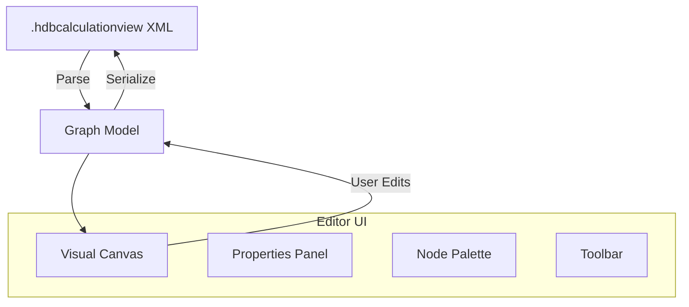

# Graphical Calculation View Editor

A visual graph editor for SAP HANA `.hdbcalculationview` files, integrated into the Web UI and VSCode extension. Design and edit calculation views using drag-and-drop nodes, configure joins, define calculated columns, and manage hierarchies — all without leaving your development environment.

## Overview

The Calculation View Editor parses `.hdbcalculationview` XML files into a visual graph, allowing you to manipulate the data flow graphically and save changes back to the standard XML format understood by HANA HDI deployments.



## Key Features

| Feature | Description |
|---------|-------------|
| **Graph canvas** | Drag-to-reposition nodes with automatic layout (ELK.js) |
| **Node types** | Projection, Join, Aggregation, Rank, Union, Semantics |
| **Properties panel** | Context-sensitive editing for selected nodes |
| **Column mapping** | Visual drag-and-drop column mapping between nodes |
| **Join conditions** | Graphical join condition builder with operator selection |
| **Calculated columns** | Expression editor with Monaco for CE functions |
| **Input parameters** | Define and configure input parameters with type constraints |
| **Filters** | Expression-based filter definitions per node |
| **Hierarchies** | Level and parent-child hierarchy configuration |
| **Restricted measures** | Measure definitions with filter builders |
| **Multi-tab editing** | Open multiple calculation views simultaneously |
| **Undo/Redo** | Per-tab undo/redo stacks with keyboard shortcuts |
| **File management** | Create, open, save, and browse project files |

## Getting Started

### In the Web UI

```bash
# Start the hana-cli server
hana-cli ui

# Navigate to the Calculation View Editor in the Vue UI
# Open any .hdbcalculationview file from the project browser
```

### In VSCode

The [VSCode Extension](/03-features/vscode-extension) registers a custom editor for `.hdbcalculationview` files. Simply double-click any calculation view file in the Explorer panel — it opens directly in the graphical editor.

### Via REST API

The editor backend exposes three endpoints for file operations:

| Endpoint | Method | Description |
|----------|--------|-------------|
| `/hana/calcview/project/list` | GET | List `.hdbcalculationview` files in a directory |
| `/hana/calcview/project/read` | GET | Read a file's XML content |
| `/hana/calcview/project/write` | POST | Save XML content to a file |

## Editor Interface

### Canvas

The main workspace displays the calculation view as a directed graph:

- **Nodes** represent data sources, transformations, and the semantics layer
- **Edges** show data flow direction between nodes
- **Auto-layout** uses the ELK.js algorithm for clean, readable graphs
- **Drag to reposition** — move nodes freely on the canvas
- **Zoom and pan** — navigate large calculation views easily

### Node Palette

A collapsible sidebar offers node types you can drag onto the canvas:

- **Data Source** — Reference a table, view, or another calculation view
- **Projection** — Select/rename columns from a source
- **Join** — Combine two data sources with join conditions
- **Aggregation** — Group and aggregate measures
- **Union** — Combine multiple sources vertically
- **Rank** — Window function-based ranking
- **Semantics** — The top-level output node (always present)

### Properties Panel

When you select a node, the resizable properties panel shows context-specific tabs:

| Tab | Available On | Purpose |
|-----|-------------|---------|
| **View Properties** | All nodes | Name, description, metadata |
| **Mapping** | Projection, Aggregation | Column selection and mapping |
| **Join Conditions** | Join nodes | Define join type and key columns |
| **Filters** | Most nodes | Expression-based row filtering |
| **Calculated Columns** | Semantics, Aggregation | Define computed columns |
| **Parameters** | Semantics | Input parameter definitions |
| **Hierarchies** | Semantics | Level/parent-child hierarchies |
| **Restricted Measures** | Semantics | Measures with filter conditions |
| **Semantics Columns** | Semantics | Column type and label configuration |

### Toolbar

The editor toolbar provides:

- **Save** (Ctrl+S) — Write changes back to the XML file
- **Undo** (Ctrl+Z) / **Redo** (Ctrl+Y) — Per-tab history
- **Auto-layout** — Re-arrange all nodes using ELK algorithm
- **Zoom controls** — Fit to screen, zoom in/out
- **Add node** — Quick-add from toolbar button

## Workflow

### Creating a New Calculation View

1. Click **New** in the project browser or use the Create dialog
2. Choose a name and target directory
3. A new file is created with a default Semantics node
4. Add data sources by dragging from the node palette
5. Connect nodes by dragging edges between them
6. Configure properties (columns, joins, filters)
7. Save the file

### Editing an Existing View

1. Open the file browser and select a `.hdbcalculationview` file
2. The XML is parsed and rendered as a graph
3. Click any node to view/edit its properties
4. Make changes (add nodes, configure joins, map columns)
5. Save — the editor serializes back to valid XML

### Column Mapping

To map columns between connected nodes:

1. Select a downstream node (Projection, Join, Aggregation)
2. Open the **Mapping** tab in the properties panel
3. Available source columns appear on the left
4. Drag columns to the output list, or click to add/remove

### Defining Join Conditions

1. Select a Join node
2. Open the **Join Conditions** tab
3. Select the join type (Inner, Left Outer, Right Outer, Full Outer)
4. Add condition pairs: left column, operator, right column
5. Multiple conditions are combined with AND

## File Format

The editor reads and writes standard `.hdbcalculationview` XML files compatible with SAP HANA HDI deployment:

```xml
<?xml version="1.0" encoding="UTF-8"?>
<Calculation:scenario xmlns:Calculation="http://www.sap.com/ndb/BiModelCalculation.ecore"
    id="MY_CALC_VIEW" applyPrivilegeType="NONE"
    dataCategory="CUBE" schemaVersion="3.0">
  <dataSources>
    <DataSource id="SALES">
      <resourceUri>SALES</resourceUri>
    </DataSource>
  </dataSources>
  <calculationViews>
    <calculationView xsi:type="Calculation:ProjectionView" id="Projection_1">
      <input node="SALES">
        <mapping xsi:type="Calculation:AttributeMapping"
            target="REGION" source="REGION"/>
      </input>
    </calculationView>
  </calculationViews>
  <logicalModel id="Projection_1">
    <attributes>
      <attribute id="REGION" order="1"/>
    </attributes>
    <measures>
      <measure id="REVENUE" order="2" aggregationType="sum"/>
    </measures>
  </logicalModel>
</Calculation:scenario>
```

## REST API Reference

### List Files

```bash
GET /hana/calcview/project/list?path=/path/to/project/db/src
```

**Response:**
```json
[
  {
    "name": "MY_CALC_VIEW",
    "fileName": "MY_CALC_VIEW.hdbcalculationview",
    "filePath": "/path/to/project/db/src/MY_CALC_VIEW.hdbcalculationview",
    "lastModified": "2026-05-17T10:30:00.000Z",
    "size": 4520
  }
]
```

### Read File

```bash
GET /hana/calcview/project/read?file=/path/to/MY_CALC_VIEW.hdbcalculationview&base=/path/to/project
```

**Response:**
```json
{
  "xml": "<?xml version=\"1.0\" ...?>...",
  "filePath": "/path/to/project/db/src/MY_CALC_VIEW.hdbcalculationview"
}
```

### Write File

```bash
POST /hana/calcview/project/write
Content-Type: application/json

{
  "file": "/path/to/MY_CALC_VIEW.hdbcalculationview",
  "xml": "<?xml version=\"1.0\" ...?>...",
  "base": "/path/to/project"
}
```

**Response:**
```json
{ "success": true, "filePath": "/path/to/project/db/src/MY_CALC_VIEW.hdbcalculationview" }
```

## Security

- **Extension validation** — Only files ending in `.hdbcalculationview` can be read or written
- **Path traversal protection** — When a `base` parameter is supplied, the resolved file path must reside within that directory
- **No database access** — The file routes operate purely on the filesystem; database connections are not required for editing

## Technology Stack

| Component | Purpose |
|-----------|---------|
| Vue 3 + Composition API | Editor UI framework |
| Vue Flow (v-flow) | Graph canvas rendering and interaction |
| ELK.js | Automatic graph layout algorithm |
| Monaco Editor | Expression editing (calculated columns, filters) |
| Pinia | State management for editor model |

## See Also

- [Calc View Analyzer](/02-commands/analysis-tools/calc-view-analyzer) — Runtime performance analysis of calculation views
- [VSCode Extension](/03-features/vscode-extension) — Native IDE integration with custom editor
- [Web UI](/03-features/web-ui/) — Web user interface overview
