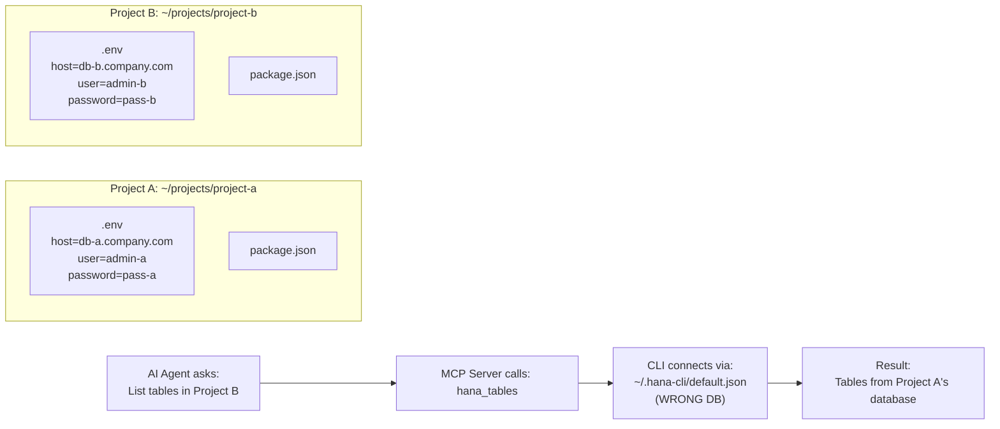
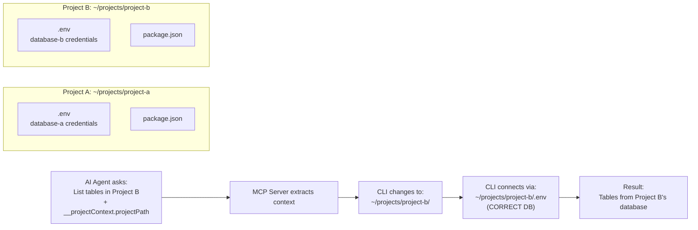
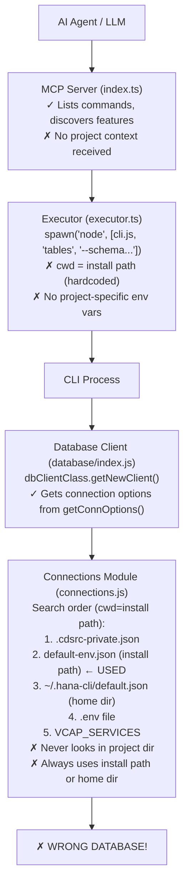
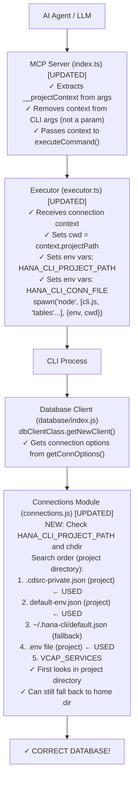
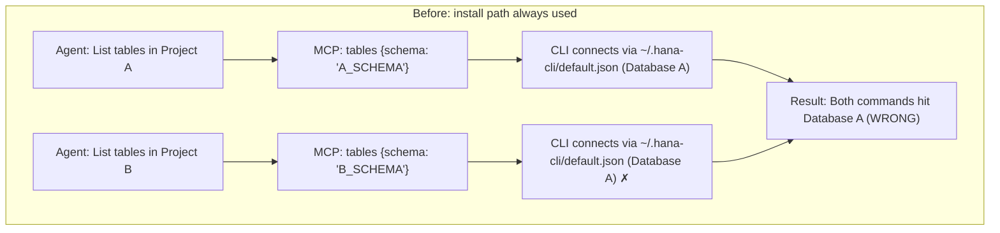
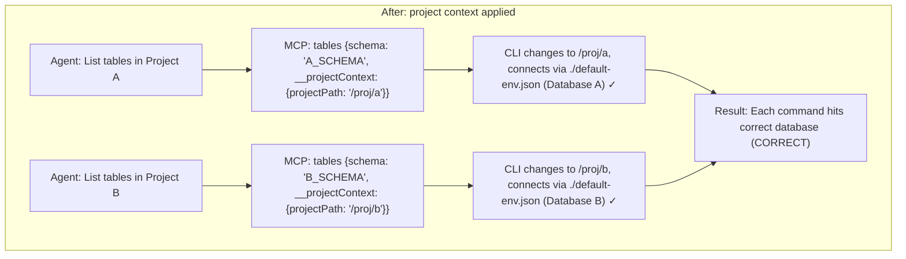
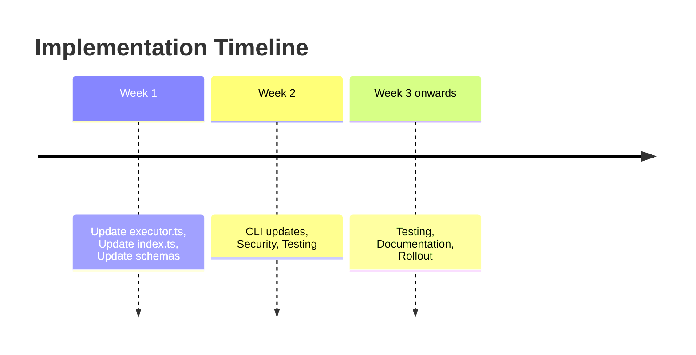
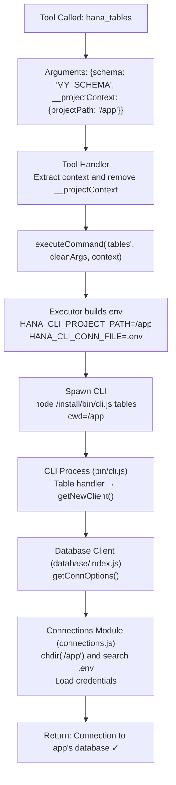
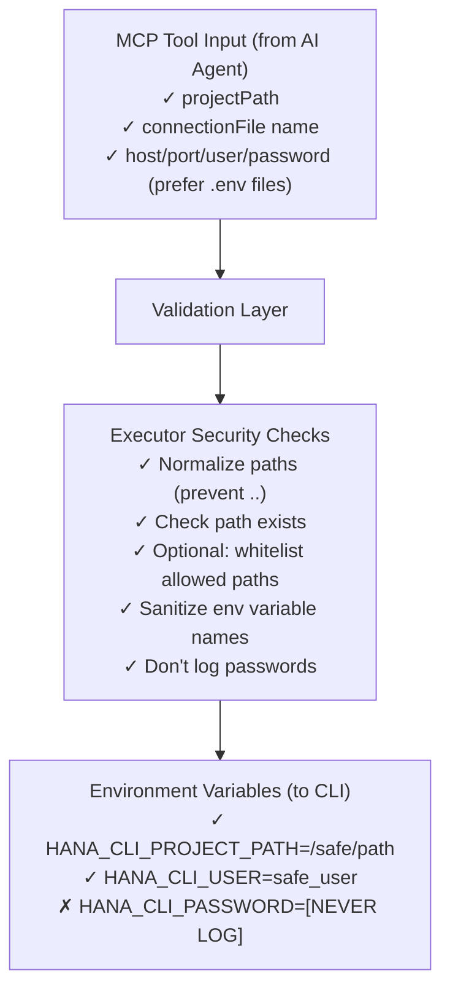

# MCP Connection Context - Visual Summary

## The Problem: Connection Mismatch



## The Solution: Project Context Passing



---

## Current Architecture



## Proposed Architecture



---

## Message Flow Comparison

### Before (All commands use install path)



### After (Each command uses project context)



---

## Implementation Timeline



---

## Key Code Sections to Modify

| Component | File | Lines | Change Type |
| --------- | ---- | ----- | ----------- |
| Context Interface | `mcp-server/src/connection-context.ts` | NEW | Create |
| Executor Function | `mcp-server/src/executor.ts` | 240-280 | Update signature & spawn |
| Tool Handler | `mcp-server/src/index.ts` | 145, 1325 | Update schemas & handler |
| CLI Connections | `utils/connections.js` | 92-110 | Add env var checks |

---

## Data Flow: Single Command Execution



---

## Backward Compatibility

```mermaid
flowchart LR
     subgraph Current[Current Users (No Context)]
          C1["MCP Tool Call: hana_tables<br/>{schema: 'X_SCHEMA'}"] --> C2["Behavior:<br/>No context extracted<br/>Uses install path (cwd)<br/>Finds ~/.hana-cli/default.json<br/>Works as before ✓"]
     end
     subgraph New[New Users (With Context)]
          N1["MCP Tool Call: hana_tables<br/>{schema: 'X_SCHEMA', __projectContext: {...}}"] --> N2["Behavior:<br/>Context extracted<br/>Uses project path (cwd)<br/>Finds /project/.env<br/>Works correctly ✓"]
     end
```

---

## Security Model



---

## Testing Matrix

| Test Case | Before | After | Expected |
| --- | --- | --- | --- |
| No context param | ✓ Works | ✓ Works | Same behavior |
| With projectPath | ✗ Ignored | ✓ Used | Uses project dir |
| With connectionFile | ✗ Ignored | ✓ Used | Uses specified file |
| With direct credentials | ✗ Ignored | ✓ Used | Direct connection |
| Context switching | ✗ N/A | ✓ Works | Each cmd gets own DB |
| Multiple projects | ✗ Fails | ✓ Works | Isolated contexts |

---

## Benefits Summary

| Perspective | Benefit |
| ----------- | ------- |
| **AI Agents** | Can work with multiple projects, switching databases mid-conversation |
| **Developers** | No manual connection setup per project |
| **Teams** | Project-specific DBs for different environments (dev/test/prod) |
| **Security** | Each project isolated to its credentials |
| **Backward Compat** | Existing integrations work unchanged |

---

## Quick Reference: 5-Step Implementation

1. **Create interface** → `connection-context.ts`
2. **Update executor** → Handle context in `executeCommand()`
3. **Update MCP tools** → Pass context from handler
4. **Update CLI** → Check env vars in `connections.js`
5. **Test & Deploy** → Backward compatible, no breaking changes
