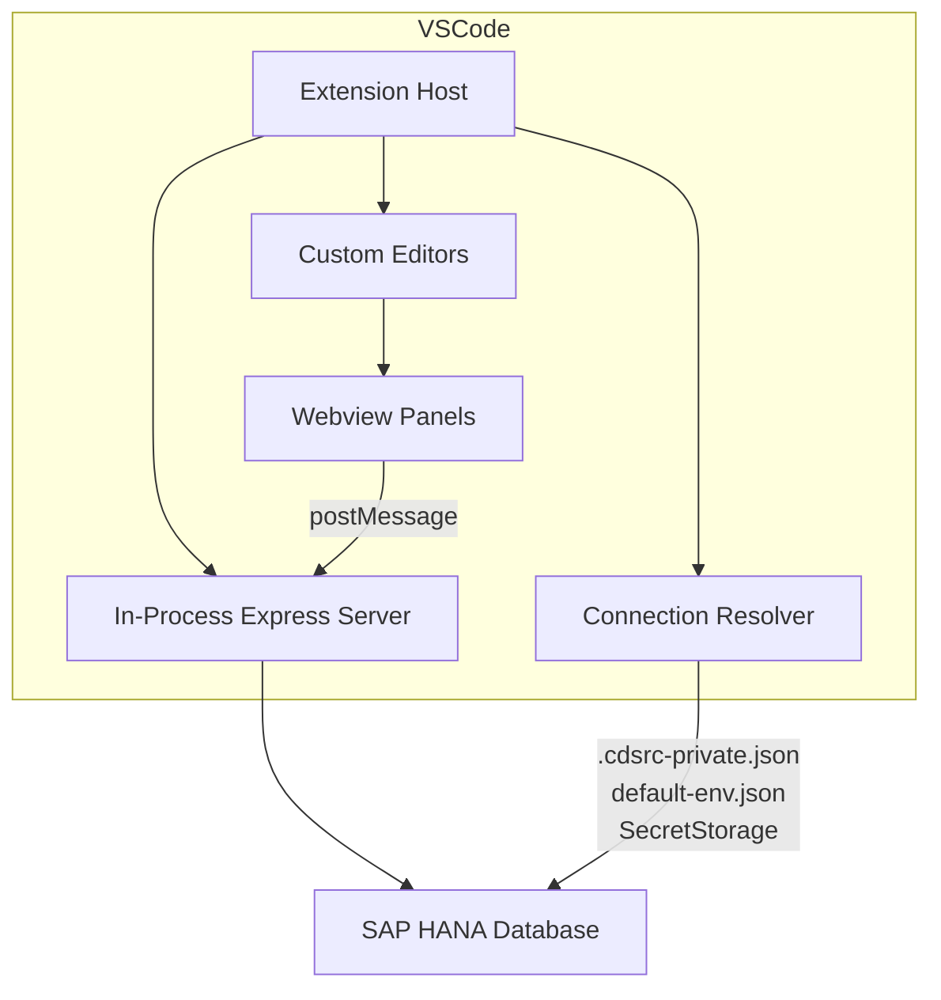
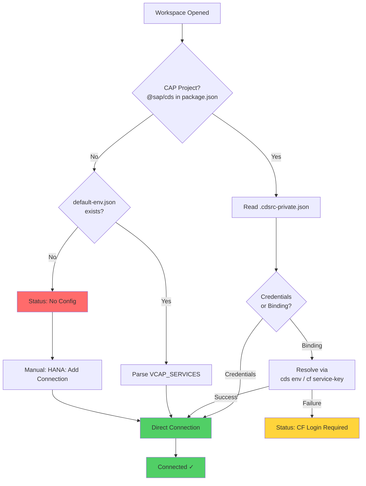

# VSCode Extension

A native Visual Studio Code extension that brings hana-cli's database tools, visual editors, and inspectors directly into your IDE — no browser required.

## Overview

The extension embeds the hana-cli Vue web application inside VSCode webview panels, running an in-process Express server to serve the UI and handle database requests. It provides custom editors for HANA artifacts and automatic connection resolution from your project's existing configuration.



## Features

### Custom Editors

The extension registers visual editors that open automatically for HANA artifact files:

| File Pattern | Editor | Mode |
|-------------|--------|------|
| `*.hdbcalculationview` | Calculation View Editor | Read/Write |
| `*.hdbtable` | Table Inspector | Read-only |
| `*.hdbmigrationtable` | Table Inspector | Read-only |
| `*.hdbview` | View Inspector | Read-only |
| `*.hdbprocedure` | Procedure Inspector | Read-only |
| `*.hdbfunction` | Function Inspector | Read-only |
| `*.hdbsynonym` | Synonym Inspector | Read-only |
| `*.hdbrole` | Role Inspector | Read-only |
| `*.hdbsequence` | Sequence Inspector | Read-only |

Double-click any of these files in the Explorer — the custom editor opens instead of raw XML/text.

### Calculation View Editor

The full [Graphical Calculation View Editor](/03-features/calc-view-editor) is available as a VSCode custom editor with native save integration:

- **File lifecycle** — Open, edit, save, undo/redo all integrated with VSCode
- **Dirty tracking** — Modified files show the dot indicator in the tab
- **Backup/recovery** — Automatic backup for crash recovery
- **Keyboard shortcuts** — Standard Ctrl+S, Ctrl+Z, Ctrl+Y work as expected

### Tools Panel

Access the full hana-cli toolset via the command palette:

- **HANA: Open hana-cli Tools** — Full tools dashboard
- **HANA: New Query Editor** — SQL query editor
- **HANA: Show Tables** — Browse database tables
- **HANA: Show Views** — Browse database views
- **HANA: System Info** — Database system information
- **HANA: Import Data** — Data import wizard
- **HANA: CF Login** — Cloud Foundry login flow

### Connection Management

The extension resolves database connections automatically using a three-step strategy:



1. **CAP-first** — If the workspace is a CAP project (has `@sap/cds` dependency), reads `.cdsrc-private.json` for credentials or CF bindings
2. **default-env.json** — Falls back to the standard `default-env.json` VCAP_SERVICES format
3. **Manual entry** — Use **HANA: Add Connection** command to enter credentials stored securely in VSCode's SecretStorage

A status bar item shows the current connection state at all times.

### Architecture

The extension uses a **Hybrid Direct Webview + Embedded Server** architecture:

- **In-process Express** — The Express server runs inside the extension host process (not a child process), sharing the Node.js runtime
- **Lazy startup** — The server starts on first webview open and auto-shuts down when all webviews close
- **Dynamic port** — A free port is allocated automatically; no conflicts with other services
- **Dual Vite build** — The Vue app is built once for standalone web use and once for VSCode webview embedding via a dedicated Vite config (`vite.config.vscode.ts`)
- **Secure webviews** — Content Security Policy (CSP) with nonces prevents XSS; only the embedded server origin is allowed

## Installation

### From the CLI

Once `hana-cli` is installed (globally via `npm install -g hana-cli`, or in a project), a prebuilt `.vsix` ships inside the npm package, so `install` works offline with no build step:

```bash
# Check if the extension is installed
hana-cli vscode status

# Install from the bundled .vsix package
hana-cli vscode install

# Install for VS Code Insiders
hana-cli vscode install --insiders

# Uninstall
hana-cli vscode uninstall
```

The bundled `.vsix` is self-contained and OS-portable — it includes the web UI assets and uses Node's built-in `node:sqlite` driver, so there is no platform-specific native binary and no per-OS rebuild.

### From VS Code

1. Open the Extensions panel (Ctrl+Shift+X)
2. Search for `SAP-samples.hana-cli`
3. Click **Install**

### From Source (Development)

::: warning Install the parent project first
The extension's bundle step reaches into the **root** hana-cli project's `node_modules`, `routes/`, and `utils/` (they are inlined into the extension). You must install the root project's dependencies **before** building the extension, or esbuild fails with dozens of `Could not resolve "express" / "exceljs" / "@sap/cds" …` errors.
:::

```bash
# 1. From the repo ROOT — install parent deps the bundle inlines
npm ci

# 2. Build the Vue web UI for the webview + bundle the extension.
#    This copies the UI assets into vscode-extension/webview-dist so the
#    packaged .vsix is self-contained.
npm run build:vscode

# 3. Package as .vsix
cd vscode-extension
npx vsce package --no-dependencies

# 4. Install the generated .vsix
code --install-extension hana-cli-0.1.0.vsix
```

## Requirements

- **VS Code** 1.85.0 or later
- **Node.js** 20.19.0+ (for the embedded server)
- **hana-cli** installed globally or the extension includes its dependencies

### Compatibility

| Environment | Supported |
|-------------|-----------|
| VS Code Desktop (Windows/macOS/Linux) | Yes |
| VS Code Remote - SSH | Yes |
| VS Code Remote - Containers | Yes |
| GitHub Codespaces | Yes |
| SAP Business Application Studio | Yes |
| VS Code for the Web (vscode.dev) | No |

::: info Why not VS Code Web?
The extension requires a Node.js runtime for the in-process Express server and filesystem access for reading HANA artifacts. Browser-only environments cannot provide these capabilities.
:::

## Configuration

### Automatic Activation

The extension activates automatically when your workspace contains any of:

- `*.hdbcalculationview` files
- `*.hdbtable` files
- `default-env.json`
- `.cdsrc-private.json`

No manual activation is needed for typical SAP HANA development projects.

### Connection Preferences

Connections are resolved in priority order:

1. CAP binding (`.cdsrc-private.json`) — most secure, no local credentials
2. Default environment (`default-env.json`) — standard SAP local development
3. SecretStorage — credentials entered via the Add Connection command

To switch connections, use the **HANA: Add Connection** command from the Command Palette.

## Commands Reference

| Command | Title | Description |
|---------|-------|-------------|
| `hana-cli.openTools` | HANA: Open hana-cli Tools | Open the full tools dashboard |
| `hana-cli.openQuery` | HANA: New Query Editor | Open a SQL query editor |
| `hana-cli.showTables` | HANA: Show Tables | Browse database tables |
| `hana-cli.showViews` | HANA: Show Views | Browse database views |
| `hana-cli.systemInfo` | HANA: System Info | Show system information |
| `hana-cli.addConnection` | HANA: Add Connection | Enter connection credentials |
| `hana-cli.importData` | HANA: Import Data | Import data from CSV/JSON |
| `hana-cli.openCfLogin` | HANA: CF Login | Trigger Cloud Foundry login |

Access all commands via the Command Palette (Ctrl+Shift+P) by typing "HANA".

## Context Menu Integration

Right-click `.hdbtable` or `.hdbview` files in the Explorer to see the **HANA: Open hana-cli Tools** option in the context menu.

## Troubleshooting

### Extension not activating

Ensure your workspace contains at least one activation trigger file (`.hdbcalculationview`, `.hdbtable`, `default-env.json`, or `.cdsrc-private.json`). You can also trigger activation manually via any `hana-cli.*` command from the Command Palette.

### Connection status shows "No Config"

The extension could not find connection credentials. Options:

1. Run `cds bind` in a CAP project to create `.cdsrc-private.json`
2. Create a `default-env.json` with HANA credentials (use `hana-cli connect`)
3. Use **HANA: Add Connection** to enter credentials manually

### CF Login Required

The extension found a CAP binding but could not resolve credentials. Run:

```bash
cf login -a <your-api-endpoint>
```

Then reload the VS Code window (Ctrl+Shift+P → "Reload Window").

### Webview shows blank/error

- Check the Output panel (View → Output → select "hana-cli" channel) for errors
- Ensure no firewall is blocking localhost connections
- Try reloading the window

## See Also

- [Graphical Calculation View Editor](/03-features/calc-view-editor) — Editor capabilities in detail
- [Installation Guide](/01-getting-started/installation) — CLI and extension setup
- [Analytics & Reporting](/03-features/analytics) — Data visualization features
- [Web UI](/03-features/web-ui/) — Browser-based alternative
