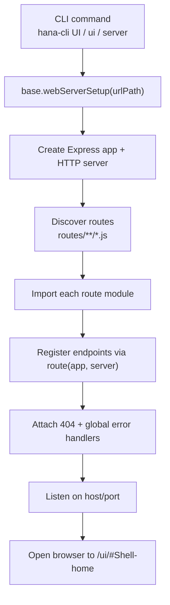
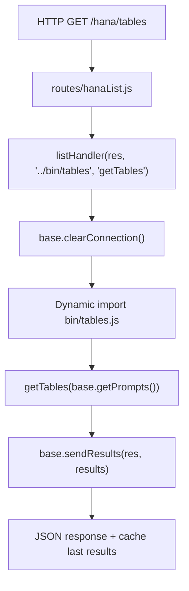
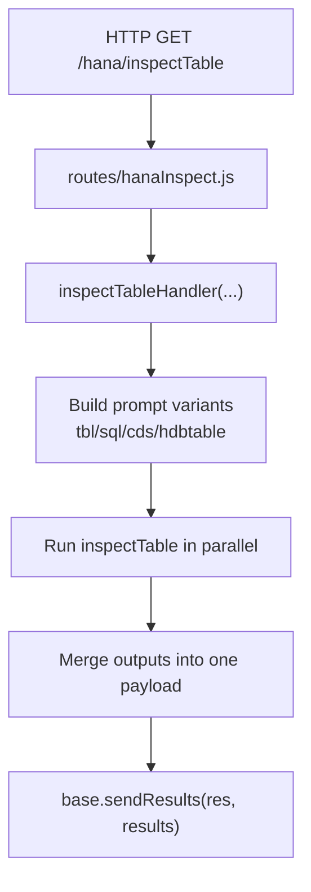
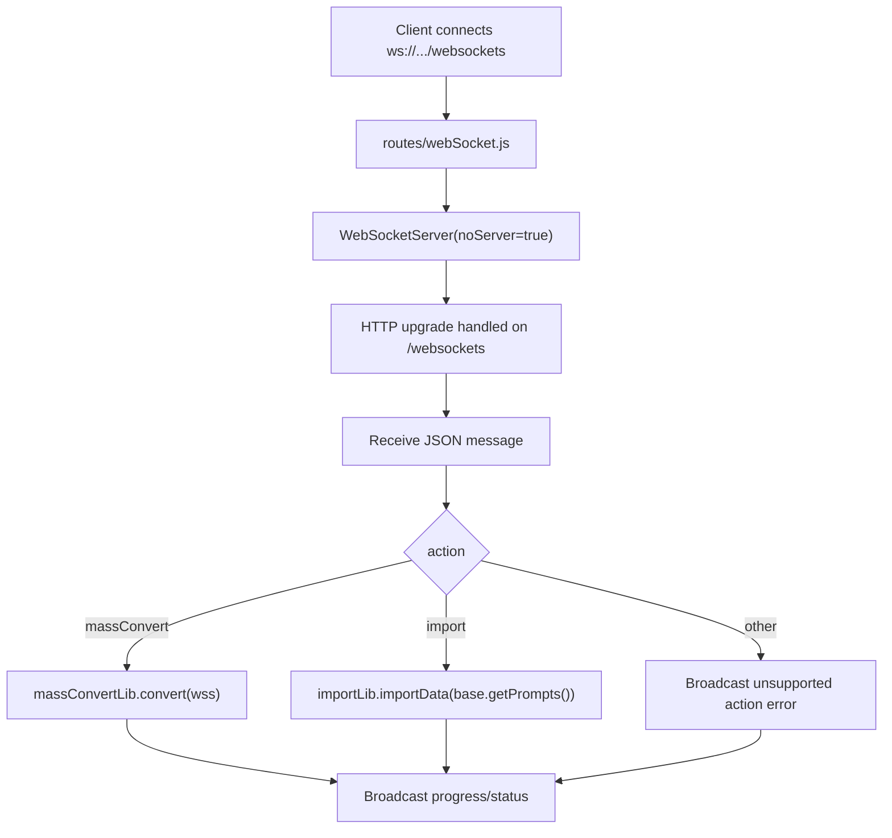
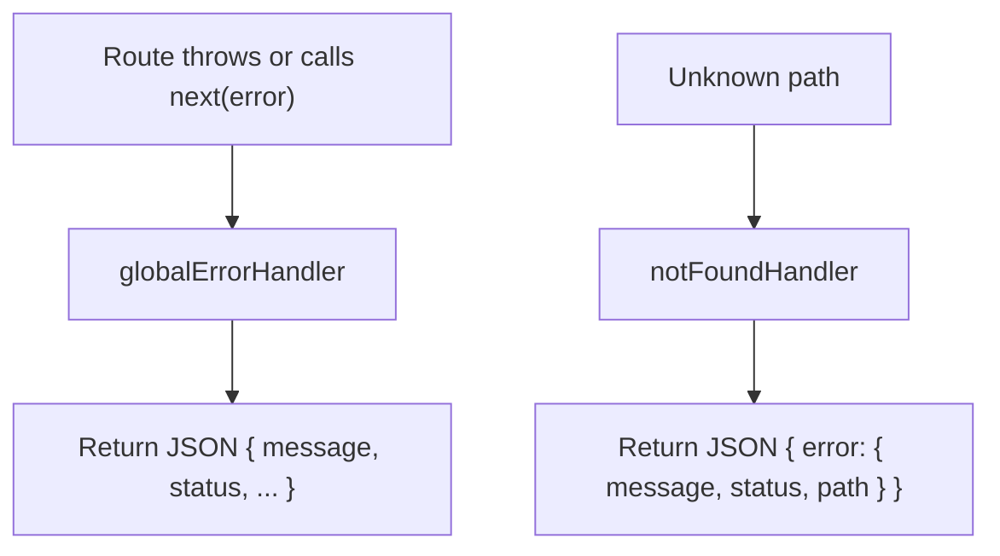

# Command and Request Flows

This page focuses on the runtime flow used by the web server and API routes.

## Server Startup Flow

## HTTP List Endpoint Flow (`/hana/tables` example)

## Inspect Endpoint Flow (`/hana/inspectTable`)

## WebSocket Action Flow

## Error Handling Flow

## See Also

- [REST API Documentation](./index.md)
- [HTTP Routes](./http-routes.md)
- [Swagger API Documentation](./swagger.md)
