# Command Execution Flow

Visual diagrams showing how HANA CLI commands are processed and executed.

## Overall Command Flow

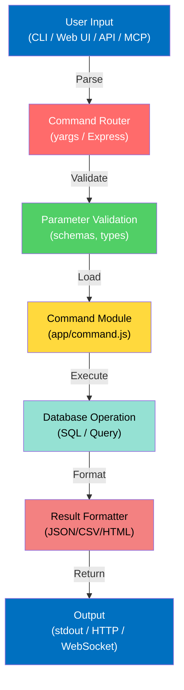

## Command Parser & Router

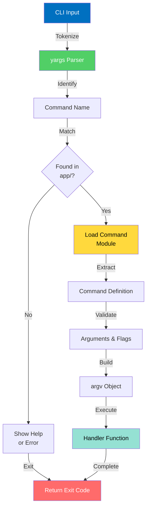

## Database Connection Flow

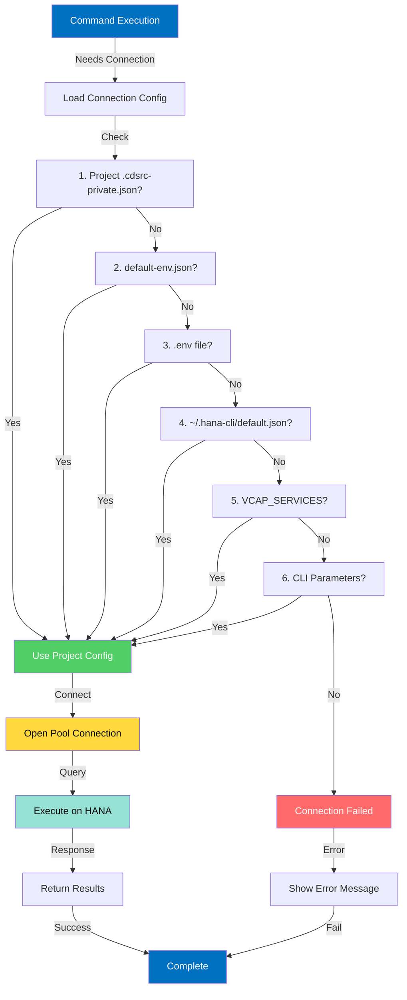

## Data Import Process

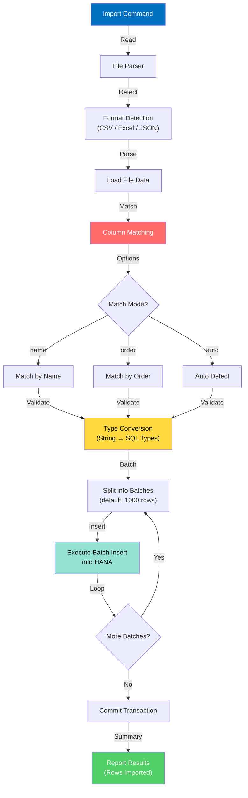

## Data Export Process

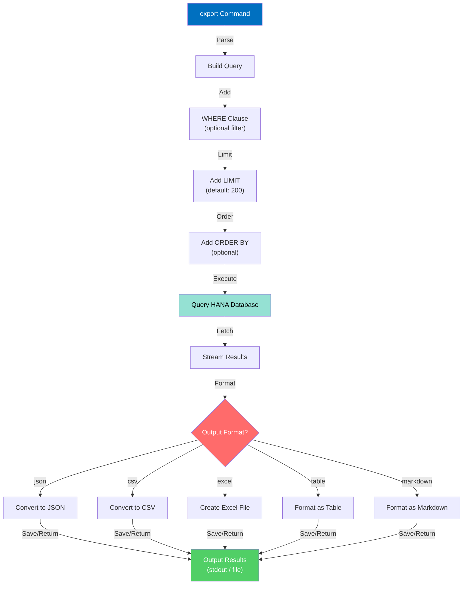

## Schema Comparison Process

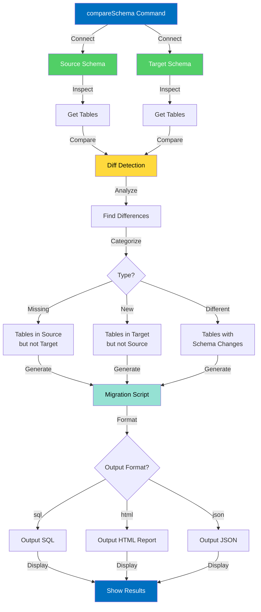

## MCP Server Message Flow

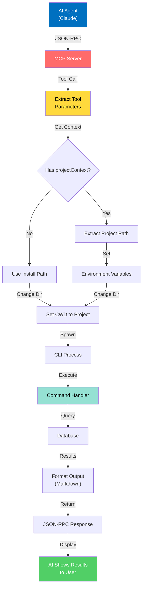

## Web UI Command Execution

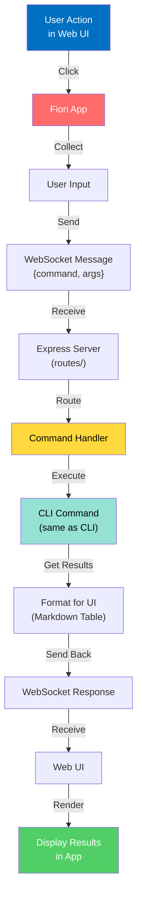

## REST API Request Flow

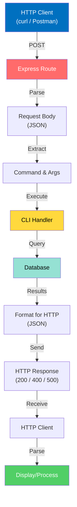

## Error Handling Flow

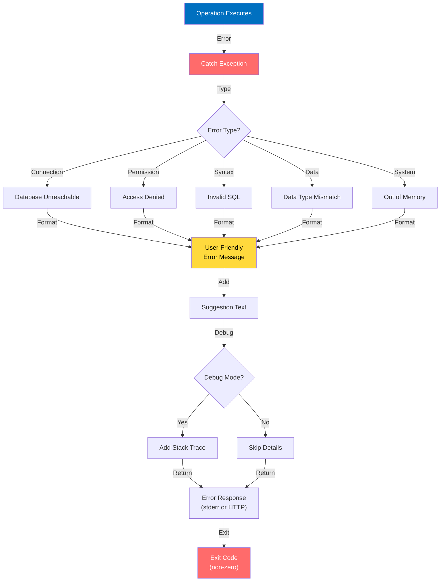

## Performance Optimization Flow

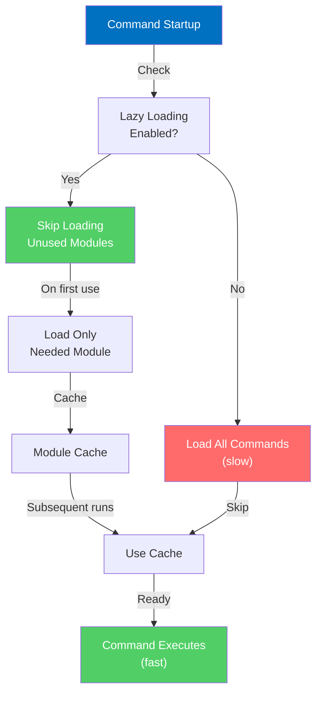

## See Also

- [REST API Documentation](./index.md)
- [Swagger Interactive Docs](./swagger.md)
- [Command Reference](../../02-commands/)
- [Architecture Details](../../developer-notes/architecture/application.md)
